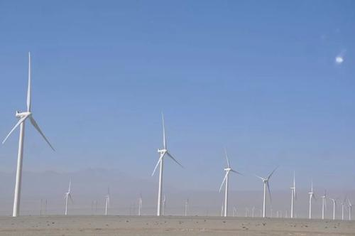
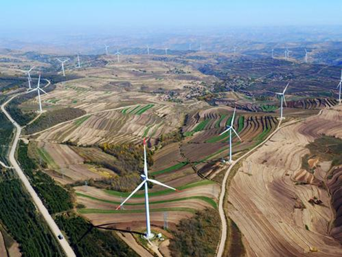

# 甘肃风力发电基地 蔡於凯 编
# 目录：
### 1.风力发电工程背景

2.发展现状

3.发展目标

4.存在的问题

5.取得的成就

# 1.背景:
甘肃风电一期工程：
2007年11月底，国家发改委同意甘肃省开展酒泉千万千瓦级风电基地及配套电网工程前期工作；
2008年3月，省发改委组织完成了酒泉千万千瓦级风电基地风电项目预可行性研究报告；
2008年4月，该报告获国家发改委审查通过；
2008年5月，该项目建设方案获批；
2009年2月，酒泉千万千瓦级风电基地完成电场项目上报核准前期工作；
2009年4月，国家发改委正式核准批复酒泉风电基地风电场项目；
2009年8月8日，酒泉千万千瓦级风电基地一期工程拉开序幕。

# 2.发展现状:
短短几年，河西走廊凭空腾起三千余座白色风机，总装机容量达550万千瓦，占全省电力装机的17%。据统计，2010年酒泉工业园区总产值234亿元，同比增长320%；税收2.52亿元，同比增长256%

# 3.发展目标：
### 甘肃风电二期工程
发改委目前已经同意酒泉千万千瓦级风电基地二期工程开展前期工作。据了解，酒泉千万千瓦级风电基地二期工程的装机为800万千瓦。
甘肃省省委书记“陆浩”指出，建设河西走廊风电基地，是一项庞大的系统工程，要分三步走：
第一步，到2015年，装机容量达到1000万千瓦，成为全国最大的风电基地之一；
第二步，到2020年，装机容量增加到2000万千瓦，建成陆上“三峡”工程；
第三步，2020年以后，装机容量继续扩大到3000万千瓦以上，使河西走廊成为世界上最大的风电基地，成为真正的“陆上风电三峡“

# 4.存在的问题：
## 问题一：发电容易输送难 电网建设的制约

甘肃河西电网目前串联着7座变电所，输电线路全长约1000公里，是国内输电距离最长、串联变电所最多的330千伏电网。整个西电东送的能力仅为70万千瓦，根本无法满足现有的50万千瓦风电的送出需要。2009年，甘肃省电力公司投资120亿元，建设一条河西750千伏的双回输电线路。但经计算，仍然无法满足2010年计划生产的516万千瓦风电送出需要。

## 问题二：电网调峰能力不足

风电具有“风”的间歇性、波动性、随机性特点，加上风电的自储能力还不成熟，风电发电负荷难以保持稳定。甘肃电力公司有关专家表示，目前甘肃电网能够承担风电调峰的发电能力约150万千瓦，根本无法满足未来风电所需要调峰能力的要求。该专家指出：如果要实现河西2000万千瓦风电全部外送，那么就必须在风电走廊再建2000万千瓦规模的水电或火电

## 问题三：风电电力消纳难

“风电电力消纳变成了比风电并入电网更值得重视的问题。”甘肃省一家风电场有关人士表示，目前在甘肃、内蒙等风电投产速度较快的地区，普遍存在风电并网后电量难以全部消纳送出的问题。专家表示，风电消纳难的主要原因有两个，即电网输送线路不能满足风电的输送需要，火电、抽水蓄能等常规系统调峰能力电源不足。

## 问题四：风机技术水平的制约

早期生产的风机中有一些风机不具备低电压穿透功能，在有功及无功电压控制方面能力较差，并且并网运行的风电机组抗干扰能力不达标，大量并网后会对电网稳定性造成冲击。目前这些问题都有部分解决方案，采取措施电力力质量能够达到标准。大规模风电上网后，提供电力质量是各国发展风电共同面对的课题。

# 5.取得的成就：

## 1.风电产业的发展，增强了全省电力生产能力，带动了工业和服务业的发展，增加地方财源。

## 2.带动河西走廊制造业、旅游业、服务业等新兴产业的发展，促进农业人口向非农产业转移，从而逐步把河西走廊的发展纳入全面协调可持续的轨道，实现绿洲区人与自然的和谐相处。

## 3.风电产业不仅不会给环境造成压力，而且通过密度较大的风力发电装置作功后可使风速减缓，减轻风沙危害。

