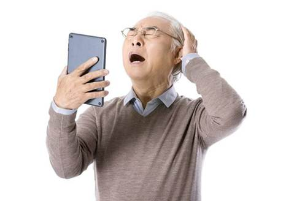
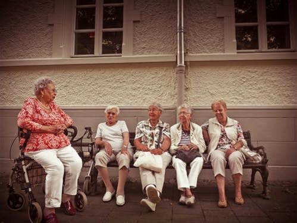
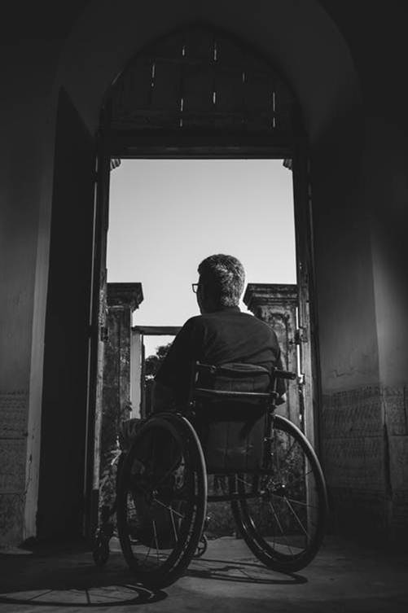

# 老年人产品中的人性化设计原则
## 目录

第一章
我国人口老龄化现状

第二章
老年产品设计现状

第三章
老年人诉求分析

第四章
老年人产品设计原则
# 一. 我国人口老龄化现状
## 老龄化现状

老年化是指老人的逐渐增多，开始在人口中占有很大的比例，老年化的出现会导致人口劳动力的不足，社会的负担越来越大，使社会发展趋向劣势，老年的赡养成本增大等问题，老龄化是社会发展必须经历的阶段，也是社会进展过程的一种体现，代表着一个国家的发展历程。

  中国老年化现状是老年化越来越严重，中国现在的老年化非常的严重，社会中越来越多的人口步入老年化，而计划生育的结果使中间劳动力短缺，中国的社会压力越来越大，所以国家相应的开始鼓励生育、开放二胎等，再进一步的对人口老龄化进行调整，保证社会的可持续发展。
## 关于老年人产品

随着我国人口呈现老龄化趋势，老年产业也成为21世纪颇具潜力的市场，研制和开发符合老年人情感需求的产品已成为企业市场竞争中寻求发展的良机。我国老年人口绝对数量居世界首位，基于他们情感需求而设计的产品却相对缺乏，设计师必须关注老年人的情感需求，在为老年设计时多应用适于老年的设计原则。

## 趋势

人类已经进入了2l世纪，同时也迈入了一个长寿时代、老龄化的时代。目前我国老年人口已经达到1.3亿，占总人口的比重超过10%。2025到2040年老年人口又将从2.84亿增长到4亿多。在未来的近半个世纪中，我国老年人口一直是呈迅速增长的趋势，老年产业已经展现出前所未有的发展机遇。但我国老年产业尚不发达，老年产品的现状远远不能满足老年人的需求。

  介于老年人特殊的生理状况，有针对性的设计出符合老年人生理、心理特征的产品是十分必要的。
# 二. 老年产品设计现状
## 老年产品设计

老年群体是一个较为特殊的群体，在生理心理、体力和脑力方面、经济和消费方面的能力都具有其自身的特点，并且这些特点随着年龄的增高更加显著。我国老年产品设计的现状基本体现为物质生活需求基本得到满足，精神文化需求匮乏。
  老年人的物质需求就包含了生活所需的衣食住行，在国内的老年市场上，老年的基本物质生活需求可以得到解决，但也仅限于基本的衣食住行需求。专门针对老年的产品设计缺乏，老年人群需求增加，而国内的老年市场满足不了老年人群的需要。

## 发达国家怎么做

在欧洲一些发达国家，由于经济的发展，人口的寿命长，比我国提早进入了老龄化社会，老年产业发达。老年人简直成了市场的宠儿，市场上专为老年人设计的商品比比皆是。在纽约繁华的商业街己有多家老年人商店，老年人玩具公司、老年人旅游公司、老年教育中心也相继出现。

## 老年人需求

相较于其他年龄层次的人，老年人也有自己的生活需求。而跟年轻阶段的人群货婴幼儿人群的生活产品都比较丰富，无论从哪一方面看，社会上生产、设计的产品都能够满足他们的需求。比如生活方面，大到最基本的吃穿住行，小到个人生活的特殊生活习惯，都能获得自己满意的产品设计。
  而从老年人的需求来看，除了能比较方便的买到吃穿用的物品之外，其他的供老年人娱乐的精神文化方面需要的产品设计却是少之又少。

# 三. 老年人诉求分析
老年人随着年龄的增长，身体逐步出现变化，呈现出老年人身体与其他年龄阶段人群的特殊差异性，随之适合他们这一阶段的产品设计也需要相应的特殊要求，针对老年人的产品设计，特别需要强调注重的设计方面就是针对老年人生理、心理方面的因素。

## 老年人诉求

*生理因素

*社会因素

*心理因素

*其他因素
## 关于老年人

人到老年，身体各部分开始发生变化，头脑开始反应迟缓，身高、臂力和腿力都随着年龄的变化而变化，老年人的生理特点主要体现在形态的老化、感觉器官功能的下降、神经运动机能缓慢、记忆力减退、性格改变等。伴随着老年人生理的变化老年人心理特点也随之发生变化。

  老年人的心理特点表现在老年人容易产生自卑、孤独、失落、恐惧、抑郁的心理，并且多疑、敏感、固执，有时候还有些偏激，较为容易情绪化，适应周围变化的能力降低。

# 四. 老年人产品设计原则
老年产品的开发设计要以老年人为设计对象和设计尺度。既要满足老年人的生理需求，还要满足老年人的心理需求,应当充分体现对老年人的关爱。老年人产品的开发设计应按人体工程学原理做到符合老年人特殊的生理心理需求。比如老年人体的尺度、肌体受压小、动作方便、坐卧舒适、不易疲劳、无损健康等。

## 主要原则
### 以健康环保为标准
老年产品开发，一方面是依据老年人体工程学设计使用上方便，能满足老年人生理、心理机能衰退的特点，保障其健康使用的产品；另一方面是老年产品所用材料的环保健康性，以不损害老年人身体健康为选择最佳。以安全使用、易用为原则。
  老年产品的开发，在保证产品使用简洁的同时，还要力求巧妙的对产品符号进行视觉化简洁、让人一目了然、一看就懂、一学就会，一个按键就可以完成。易用性的老年产品展现了良好的人性化交流和沟通使产品不仅易于学习使用，而且能够满足他们的生理和情感的需要。

### 自立性设计
一个人在社会上总希望能够拥有牢固的社会地位从而得到他人的尊重，老年人尤其如此，一般老人自尊心都很强，不希望自己成为家庭、社会的负担，强烈需要得到他人的尊重和重视，他们不但需要家庭的温暖，也需要得到社会的认可，这种尊重的需求通常会使老人更加关注自己生活质量的提高。

### 审美需求设计
老年产品设计既要考虑产品的形相直觉和情趣外射对审美心理的影响。又要考虑老年人中普遍存在的审美障碍。老年产品设计中，应考虑这些心理因素的影晌，设计中多融入他们普遍认可和熟悉的元素，多从产品功能、产品造型或产品包装中，激发他们移情、外射的审美情趣，满足老年的精神文化需求。
## 总结：“关爱老人，是设计师的责任！！”

# THANK YOU