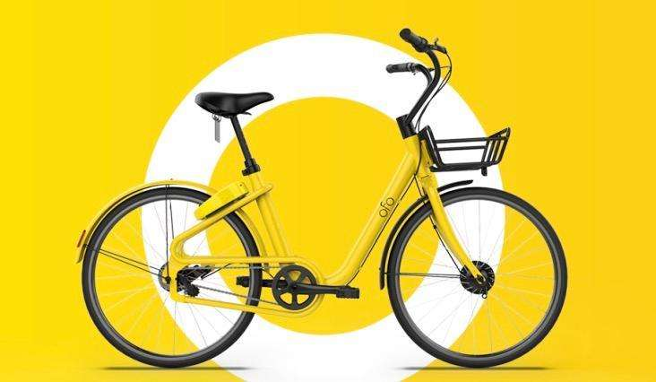
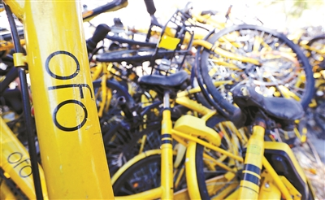

# 共享单车 —ofo

*从曾经“最好骑”的单车到“城市垃圾”的小黄车案例分析*

>## 产品设计思路

### **1.用户需求**
北京大学校园内景点多,面积大,步行游览时费力,因此成为共享单车优质市场,人们需求大。
### **2.产品设计**
整体采用明亮的黄色，容易被找到，单车由凤凰等代工厂制作，宣称成本300元
### **3.租赁方式**
自行车被装上了密码锁，手机扫码后获得开锁密码，按骑行时间或里程计费。扫码取车，随扫随骑，租金低
>## 产品愿景
ofo的理念是，**“骑时可以更轻松”**。

在未来ofo希望不生产自 行车，只连接自行车，让人们在全世界的每一个角落都可以通 过ofo解锁自行车，满足短途代步的需求。 ofo同样以开放平台和共享精神，欢迎用户共享自己的单车加入ofo，以共享经济的互联网创新模式调动城市单车存量市场，提 高自行车使用效率，为城市节约更多空间。

ofo倡导文明用车，通过技术手段引导用户规范使用ofo共享单车，与市民和政府协同优化共享单车出行解决方案，让城市更美好。

>## 产品设计过程
### **OFO单车设计思路**

**ofo1.0** — 北大校园 北大师生贡献的单车

**ofo2.0** — 凤凰代加工的单车 便民、好骑、轻便、舒适

**ofo3.0** — ofo对车身进行了硬件升级，比如采用了转动车铃、车把采用了三角形把立、22寸车轮、实心胎、密封中 轴、鼓刹，此外，小黄车还采用了可调节车座、以及加固的车圈。新版本小黄车升级了密码锁，从原来的方盘式按键密 码锁升级为圆柱式转盘密码锁。开锁密码多了，小黄车被猜出密码的可能性就会变小。
### **OFO单车结构性**

****
>## 产品营销 
### **ofo定位市场和定价**
**校园市场的特点：**

1.空间相对封闭  2.空间距离相对较小 3.用户需求相对集中 4.目标群体非常清楚 5. 学生对于价格敏感 6.自行车使用率非常高
定价：押金99，非校园用户1元每小时，校园认证用户优惠为0.5元每小时。不满一小时按一小时计算收费。可以说是非常适合学生，因此ofo也得到了各大资本的投资。
### **ofo的兴**

通过用户邀请获得红包和免费骑行推广→得到多轮融资后疯狂扩张市场→加上网络铺天盖地的宣传→订单上涨、出口海外

### **ofo的败**
由于ofo前期定位于校园，使用人群和环境相对固定，在车辆的防盗和质量上没有考虑特别充 分，比如车胎、链条、取车等关键环节考虑不是特别充分，导致走出校园，车身的质量就面 对巨大的考验。比起摩拜，ofo成本不到300元，但正因为成本低，后期损坏率居高不下，路边“十辆车有九 辆是坏的”，上千万辆小黄车成了ofo的陪葬品——曾几何时，它们也被媒体标榜为“大街小 巷里一道风景”,但不久后便被迅速堆成一个个“单车坟场”

### **ofo的衰**
据媒体透露，单车制造成本约为600元。假设稳定运营之 后，每一辆“健康”的单车能够匹配到五位用户，就能吸纳1000元押金。按5%的年化收益算，平台把这1000元 押金拿去投资，每年可以得到50元收益。虽然只靠押金的投资收益不足以让共享单车盈利，但能 够加快资金回笼的速度，更重要的是，押金提供了对重资产的共享单车平台来说至关重要的现金流，顺境时加速发展，逆境时减缓败亡。

>## **ofo失败的原因**
**1.定位不清晰**

前期针对的是校园，而后期却把同样的模式投入到了社会的市场，造成了单车不能定位，寻找困难等问题

**2.过于理想化收益**

得到投资之后没有很好的规划，而是将资金投入到大量单车的生产和给用户的补贴，导致后期亏损

**3.产品功能不符合投入场景**

单车质量不行，没有考虑到后续的维修费用巨大，只看到了前期投资成本低，后续大量的损坏，一损耗了大量的资金、二造成了城市垃圾。

**4.过度依赖融资**
　　

