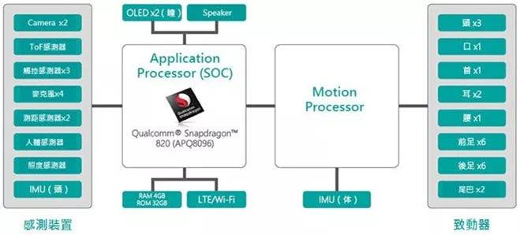

# 索尼产品发展史

## SONY发展历史

****

## SONY机器狗

>### 产品的设计思路

AIBO 的原型机是一款六条腿的‘机械蟑螂’，初始的 AIBO 身上贴着一层皮毛，令其陷入‘恐怖谷’陷阱

设计师：索尼计算机科学实验室总裁兼 
CEO 北野宏明（Hiroaki Kitano）教授

****

>### 设计过程
当时的产品周期是 5 年，所以团队就要考虑，在这个周期之内，我们能做个什么样的机器人。
团队认为，当时可能没法创造一个能做具体工作的机器人，也许做一个娱乐性质的机器人是有可能的，
它可以陪人聊天，让人们开心。最开始的原型机有六条腿，看起来像一只蟑螂。我们想，这个肯定不
行，你想想媒体标题写着‘索尼打造机器蟑螂’，就糟糕了。所以我们改进结构，将其变成四条腿的机器

人，看起来一下可爱很多。团队请来了著名设计师，后者给出的设计方案草图，看起来非常像小狗，
我们觉得，这个应该可以。当时有两种方案，一种是一体的机器狗的样式，一种是模块化的机器人，
可以用各种模块组合起来，外形多变。我们最终还是选择了机器狗的方案。值得一提的是，最开始发
售的时候，索尼从来没定义 AIBO 是机器狗，只说是娱乐型机器人。索尼不想让人们误会，公司发明
了一只机器狗，来替代真的狗。

第一次在洛杉矶著名的设计公司展示 AIBO 的时候，原型机上加了一层皮毛。那个原型机看起来太吓人了，一只吓人的机器小狗，而且太有误导性了，让人觉得这是一只真正的小狗。我们决定还是让 AIBO 有机器人的感觉，所以撤下了原型机的皮毛。

第一次在洛杉矶著名的设计公司展示 AIBO 的时候，原型机上加了一层皮毛。那个原型机看起来太吓人了，一只吓人的机器小狗，而且太有误导性了，让人觉得这是一只真正的小狗。我们决定还是让 AIBO 有机器人的感觉，所以撤下了原型机的皮毛。

**1999** 年推出 AIBO 后，产品又经历了几次迭代。但是，二十一世纪的第一个十年，坚持硬件策略的索尼公司错过了互联网时代，遭遇到发展瓶颈。随着公司经营状况恶化，高层于 **2006** 年叫停了 AIBO 项目，‘狗子’粉丝痛哭流涕。
　　　　

2000 年之后索尼公司的状况渐渐进入下行，管理层决定暂停 AIBO 项目。当然，这是组织问题，也没办法。
虽然 AIBO 项目停下了，但是大部分参与项目的工程师都去了索尼其他团队，将能力带到了公司其他产品之中。例如，索尼的卡片相机 Cybershot 有笑容快门，当用户微笑时就会拍下照片，其中使用了眼部追踪技术。
　　

当索尼公司状况逐渐好转之后，我们要使用索尼的技术，重回 AI 和机器人领域。当被问到最应该开始做什么项目时，我说，咱们把 AIBO 带回来吧。人们 AIBO 项目被砍很不开心，所以，如果要重回 AI 和机器人领域，第一件事，就应该是让 AIBO 回归。

　　
****

>### 设计愿景

新的传感器、新的网络和深度学习技术，让新版 AIBO 有机会实现团队最初的梦想——打造一个
智能机器人平台。

>### 产品相关的设计草图

>### 产品的使用场景图

>### **产品结构展示**

>#### 可自由活动的关节有22处

>#### 显示屏OLED2个

相机2个；鼻子上是前方相机，
用于确认画面；屁股上是SLAM
相机，用于描绘地图

主要有深度传感器，光学传感器，
静电感压传感器，静电感压触摸
传导器，陀螺仪和加速度传感器
，人感传导器，亮度传感器

****

如同日本SoftBank Pepper机器人，Sony把aibo视为一套机器平台，未来将提供aibo Store服务，可下载不同技能，初期仅以日本市场为主。
值得一提的是，Sony是运用既有的人工智能、传感器/驱动零组件与外型设计等技术基础，开发这新一代机器狗aibo，其全身零件数量总共多达4,000个。
新aibo也反映12年来的技术演进，透过结合各种传感器，例如最新的摄影镜头和距离影像传感器，以及影像处理技术来掌握周围环境，它也运用人工智能与云端来提高自主性，远远超过前一代产品。 

Sony在开发新一代机器狗aibo期间，为了让aibo能做出像真狗般自然的每一动作，除了设计22轴活动关节部位，采用专有的单轴/双轴致动器(即伺服马达)外，在aibo的头部与颈部部位加入致动器负责包括来回移动、左右转、点头上下与倾斜左右等4个动作都需要将大量讯号电线从头部连接到放置在身体部位上的控制基板。

此外，aibo的头部除了内建多种传感器和模拟瞳孔的AMOLED面板外，还整合用来移动耳朵和嘴巴的致动器，因此通过颈部的讯号电线数量多达90条，同时也大量运用FPC来连接致动器、传感器至控制基板，以期达到结构紧致化。
再者，为了减少功耗、维持电池续航力，便采用可兼顾高强度与轻量化的镁合金框架以做为aibo的身体框架，并有足够空间来置放36Wh电力的锂离子电池、安装各式各样的电路基板如搭载主要SoC的电路基板、LTE通信模块基板与电源基板等。

## SONY产品之路

>### 产品相关的营销及策划

在AIBO的命名上SONY也是费尽了心计的，AIBO（读音eye-bo，港、台媒体翻译为“爱宝”）这个名字拥有几重含意：AIBO是日文“同伴”的发音，同时它又与Eye-Robot（有眼睛的机器人）英文发音一样。而AIBO中A、I两个字母又是Artificial Intelligence（人工智能）的缩写。在AIBO的体内，有一片极小的晶片，就是它赋予机器狗以人的智慧。使它会像真狗一样做出各种有趣的动作，如摆尾、打滚……它也能懂得分辨对它的称呼和责备。在芯片里面，设定了它成长的过程。

****

*|.|. |      
------------|------------|------------|
.|1999年诞生的AIBO生不逢时，是因为当时身处互联网时代，索尼CEO出井伸之急需一款能为索尼持续带来附加值的产品，而不是我卖你电视的一锤子买卖|1999年诞生的AIBO生不逢时，是因为当时身处互联网时代，索尼CEO出井伸之急需一款能为索尼持续带来附加值的产品，而不是我卖你电视的一锤子买卖

那么现在呢？索尼的消费电子业务在重组后已经企稳，可以有更多余力来投资一些未曾做过或放弃已久的事情，比如AIBO。
更何况AIBO恰好迎合当下人工智能研究的潮流，但索尼的人工智能和其他公司又不太一样。
现下的人工智能，无论是苹果的Siri还是谷歌亚马逊的语音识别，都只是人机交互的一种。
但索尼的AIBO更多的是展现情感交互的一面，比如AIBO能够通过传感器知道主人喜欢什么样的卖萌方式，以后就会尽可能多地卖萌，以及学会更多的卖萌方式（对，索尼的付费云服务就是实现这一点的）。

>### 产品的定价及市场

2017年的消费级人工智能市场注定是不平凡的一年，从智能音箱“百箱大战”、到华为Mate 10首先挑起的AI芯片浪潮，到谷歌一系列产品以及iPhone X上的FaceID以及其他AI技术。索尼俨然业界的一股清流，当别人如火如荼折腾起智能音箱生态时，自己却推出了这款萌动全球的治愈系AI产品，大有一股乱点科技树的感觉，当然这也是索尼一贯的企业传统。有人打趣说，索尼大法为新一代Aibo祭出了1700美元售价，到了考验索粉信仰的时候了——唯一支撑这个售价的，就是真索粉们对索尼大法黑科技的信仰。

事实上，目前从事人机情感交互的公司或团队仍然很少，当然这是可以理解的，毕竟这是一个技术方向不明确、缺乏短期市场前景的领域，创团队在计算机视觉、语音识别等实用性应用领域中，无疑更加容易获得成果以及融资。从这个角度看，我们应该感谢索尼，在人机情感交互领域做了Aibo这款产品尝试，这无疑是消费级人工智能领域一项十分有益的探索，毕竟也许没有比做一款电子宠物狗更能够深入探索用户与机器之间情感交互模式的产品了，甚至可以说可能只有具备深厚机器人文化的日系公司才能够沉下心去积累。

>## **我们应该如何看待索尼在人工智能技术路径上的选择？**

**未来人机交互：功能性 vs 情感**

　　当我们观察消费级人工智能领域的未来趋势时，倾向于看到了功能性诉求，比如个人事务助手、自动翻译、摄影图像处理等，往往容易忽略未来智能化生活中非常重要的一项议题——当今后我们身边出现了越来越多人工智能产品、机器智能已经充斥了我们生活的方方面面时候，应该如何看待和处理人与人工智能（机器）的关系？比如说，我们到楼下便利店购物时候，结账时也许会和服务员聊几句小区附近发生的事情；但以后随着无人商店普及，服务员消失了，取而代之的是一个了解我个性化购物需求、但不知道楼上张阿姨家添丁了，即使知道也无法和我们分享喜悦的虚拟助手。智能化是未来演进的方向，但一个智能化的时代，是否必须意味着四周充斥着冷冰冰的机器？

**这绝不是未来人机交互的范式，因为不符合人性。**
因此，在人机交互中对用户情感的处理，将会是决定人和机器之间交互摩擦力大小的重要纽带。只有这样才能使得人机交互变得更加符合人性，才能获得用户的认同甚至移情，促使人机交互过程中的平等对话，使人工智能（机器）成为用户内心接纳的“伴侣”甚至“外部器官”。
索尼在人工智能宠物狗Aibo上的投入，正是朝着这个路径去积累技术。虽然在市场定价上，几乎可以认定Aibo难以获得市场意义的成功，但对于未来人机交互技术的探索上，Aibo将会是一块很好的试验田。智能语音确实是未来人机交互最重要的方向，但人机情感交互、肢体语言交互也是必不可少的组成，否则我们面对的，将会是一个冷冰冰的机器时代。

****
****

索尼在2014年起停止了初代Aibo宠物狗的维修售后服务，但在这十几年的时间内，很多购买了初代Aibo宠物狗的用户，实际上已经将Aibo当成自己家庭一份子看待，对于已经无法维修的初代Aibo宠物狗，甚至有用户组织为它们进行集体葬礼，请寺庙的僧侣为它们祷告。
