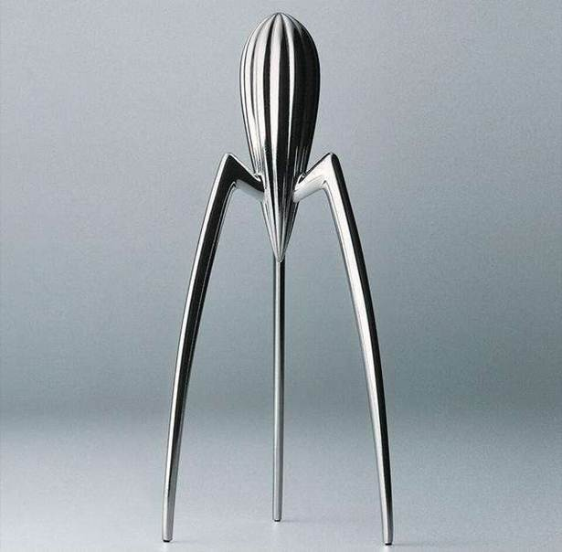
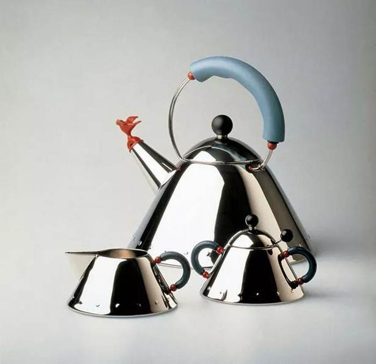
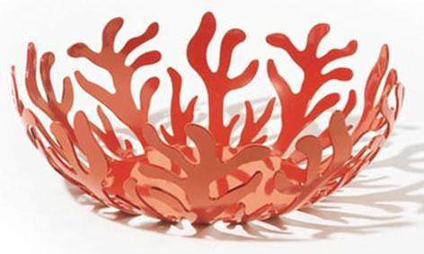
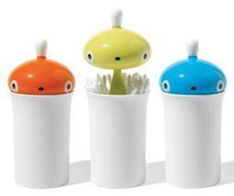
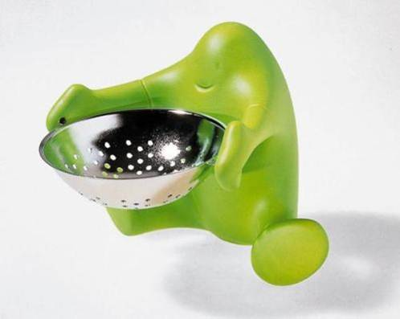
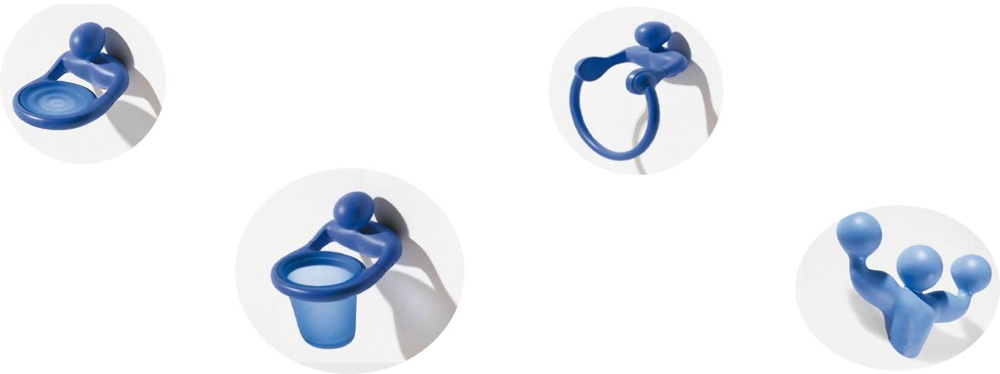

# 阿莱西的产品特色及代表 Alesi's Product Characteristics and Representatives

## 目 录  CONTENTS 
## 01 简介  Brief introduction 
## 02 发展史   Development History 
## 03 产品特色及代表  Product Characteristics and Representatives  

## 01简介  Brief introduction  

>阿莱西公司成长于米兰，它无疑是20世纪后半叶最具影响力的 产品设计公司。阿莱西公司革新了我们看待家庭用品的方式， 把生产基本实用主义产品转化为去给家庭创造革新的、多彩的、 巧妙的、实用的产品， 
这些产品包括酒瓶起子、刀具、水壶及茶具等。阿莱西公司旗 下的设计师们——“设计巨匠们”的名单就是一部现代设计的 名人录，这份名单包括：阿希里·卡斯特里尼，菲利普·斯塔 克，理查德·萨伯，米歇尔·格兰乌斯和弗兰克·盖瑞。 

## 02 发展史  Development History 

### 发展史 
>1. **1921年** 
尤费西奥开始与公 司的长期合作 
>2. **1970年** 
阿尔贝托入主阿莱 西，公司才真正进 入品牌的设计概念 时期 
>3. **1945年** 
卡洛设计了一款成 套茶具和咖啡具-Bombe 
>4. **1988-1990期间** 
通过过吉罗通多等 一系列项目企划的 实验性实施和评估， 才开始进入品牌发 展的设计战略时期 
>5.**2002年** 
开始阿莱西品牌的 多元化发展 

### 卡洛时期 
>1. 01 
卡洛时期，其子阿尔贝托大量 聘请顾问设计师，开始了与众 多设计师的合作。充分而合理 的运用设计师的创意所产生的 效益，使阿莱西伴随意大利的 经济腾飞有了坚实的积累 
>2. 02 
蒙蒂尼介入管理层的第一个重要举措正是撰 写公司的发展史，然后有了公司对设计概念 和如何产生、销售创意的观念的全新变化： 以设计评奖、产品展示、博物馆收藏、全面 的风格整理等文化运动提升设计品味等等， 在产品系列上，开始引入产品线和产品主题 的概念，形成了茶和咖啡广场、包豪斯、德 莱赛等项目品牌。 
>3. 03 
1987年后的经济萧条改变了此前的消费结 构，同时前期的项目企划在效益表现上还 没有形成合力，项目品牌间的结构似乎还 远远没有达到理想状态。设计管理的不足 渐渐浮出水面。基于战略的转型势在必行。 
04 
设计管理和设计观念的飞速发 展，使得公司对设计的控制和 协调能力充分发展。在这种能 力相对过剩的情况下，向外发 展成了业务拓展的当然选择。 

## 03产品特色及代表  Product Characteristics and Representatives 03 

### 产品特色及代表

>1. **回归自然** 
工业的迅猛发展给人们带来享受 的同时也带来了一些负面问题， 人们的生活环境恶化，工作压力 增大，人们越来越渴望到大自然 中去”透透气“。 
大自然中的事物让人感到清新、 自然、淳朴、情切，能让人减少 压力，设计的产品如果能给人一 种大自然的感觉，便易受到人们 的喜爱。 

>**水壶**：造型优美可爱，壶嘴部有个 小鸟的形象，当壶里的水烧开时， 小鸟会发出口哨声，彷佛是在唱歌， 非常有趣。 

>**水果盘**：酷似水草的造型， 让人感觉非常亲切，自然优 美的形态让人心情舒畅。 

****

>2. **具有民族文化特色** 
民族文化是依附人们的生活、习惯、情感与信仰而产生 的，具有普遍性、传承性和地域特色。从民族文化中发 掘的创新点，不仅可以使设计作品具有地域特色，还能 引发人们去过去的联想，更好地被接受，甚至可以引发 人们的民族自豪感。在西方，高帽和兔子是魔术师经常 使用的道具。 

>**棉签桶**：它的桶身部分像魔术师经常戴的高帽，盖子则像只兔子， 只要你轻轻一按，可爱的“小兔子盖子”就会弹出来，并像变魔术 一样“变出牙签”，这款设计不仅外观好看，还蕴含这西方人的生 活理念。 

****
 
>3. **具有趣味性** 
INTERESTING 
具有趣味性的产品能让人心情愉快，使人发自内心的 喜欢它。设计师往往通过对比和夸张的手法来使产品 达到出人意料的效果 。

>**滤茶器**：可爱的小人儿端着大大的滤盆在认真的为主 人服务，整个造型与功能巧妙的结合在一起，让人感 觉很自然，有趣可爱。 

****

>4. **利用卡通造型** 
通过欣赏卡通剧，人们可以回味那美好的童年，沉醉在天真自 由的世界里，暂时忘却现实的烦恼和压力。 
在产品设计中，卡通造型的产品也受欢迎，它们可以引导人们 以孩童的视角来看待生活和世界，缓解人们紧张的情绪。 

>**衣服挂钩**：造型酷似一个 拳击运动员，这种夸张造 型和鲜艳的色彩，可爱的 造型和极富有人情味的设 计给人以美的享受。 

****

