# 格式塔原则

## 目录
1.什么是格式塔原则
2.格式塔原则的应用

### 一、定义

通俗地说格式塔就是知觉的最终结果。是我们在心不在焉与没有引入反思的现象学状态时的知觉。格式塔理论（Gestalt）强调经验和行为的整体性，反对当时流行的构造主义元素学说和行为主义“刺激－反应”公式，认为整体不等于部分之和，意识不等于感觉元素的集合，行为不等于反射弧的循环。

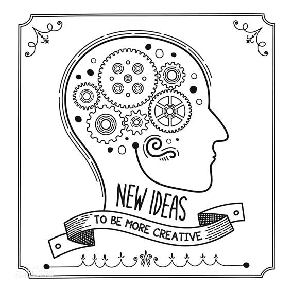

格式塔系德文“Gestalt”的音译，主要指完形，即具有不同部分分离特性的有机整体。将这种整体特性运用到心理学研究中，产生了格式塔心理学，其创始人是韦特海墨、考夫卡和苛勒。
格式塔是作为心理学术语的格式塔具有两种含义：一指事物的一般属性，即形式；一指事物的个别实体，即分离的整体，形式仅为其属性之一。也就是说，“假使有一种经验的现象，它的每一成分都牵连到其他成分；而且每一成分之所以有其特性，即因为它和其他部分具有关系，这种现象便称为格式塔。”总之，格式塔不是孤立不变的现象，而是指通体相关的完整的现象。完整的现象具有它本身完整的特性，它既不能割裂成简单的元素，同时它的特性又不包含于任何元素之内。

#### 案例1

G．A．米勒（G．A．Miller）曾举过一个有趣的例子，用以说明当时格式塔心理学的声势和构造主义的困境：当你走进心理学实验室，一个构造主义心理学家问你，你在桌子上看见了什么。

“一本书”
“不错，当然是一本书。”“可是，你‘真正’看见了什么？”
“你说的是什么意思？我‘真正’看见什么？我不是已经告诉你了，我看见一本书，一本包着红色封套的书。”
“对了，你要对我尽可能明确地描述它。”
“按你的意思，它不是一本书？那是什么？”
“是的，它是一本书，我只要你把能看到的东西严格地向我描述出来。”
“这本书的封面看来好像是一个暗红色的平行四边形。”
“对了，对了，你在平行四边形上看到了暗红色。还有别的吗？”
“在它下面有一条灰白色的边，再下面是一条暗红色的细线，细线下面是桌子，周围是一些闪烁着淡褐色的杂色条纹。”
“谢谢你，你帮助我再一次证明了我的知觉原理。你看见的是颜色而不是物体，你之所以认为它是一本书，是因为它不是别的什么东西，而仅仅是感觉元素的复合物。”
那么，你究竟真正看到了什么？格式塔心理学家出来说话了：“任何一个蠢人都知道，‘书’是最初立即直接得到的不容置疑的知觉事实！至于那种把知觉还原为感觉，不是别的什么东西，只是一种智力游戏。任何人在应该看见书的地方，却看到一些暗红色的斑点，那么这个人就是一个病人。”

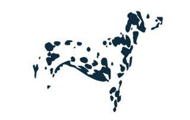

简单来说就是你的大脑有把信息化繁为简的能力，当然化繁为简不是目的，人脑会先通过简化筛选信息，找到感兴趣的信息了再了解具体内容。

### 二、原则与应用
格式塔心理学认为知觉不能被分解为小的组成部分，知觉的 基本单位就是知觉本身，格式塔心理学的信条就是：整体不同于部分之和（Ｔhe whole is different from the sum of its parts).格式塔心理学强调结构的整体作用和产生知觉的组成成分之间的联系。

1.相近
距离相近的各部分趋于组成整体
2.相似
在某一方面相似的各部分趋于组成整体
3.封闭
彼此属性、构成封闭实体的各部分趋于组成整体
4.连续
我们倾向于完整地连接一个图形，而不是观察残缺的线条或形状
5.简单
具有对称、规则、平滑的简单图形特征的各部分趋于组成整体

#### 一、相近原则

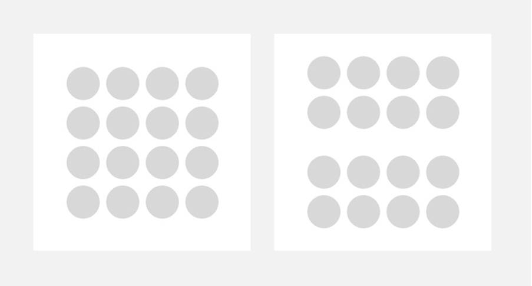
同样都是16个圆形，你会把左图的16个圆形当成一个整体；但是右边那幅图，上面8个圆形和下面8个圆形分别靠近，所以你会把上面8个圆形当成一个整体，下面8个当成另外一个整体。

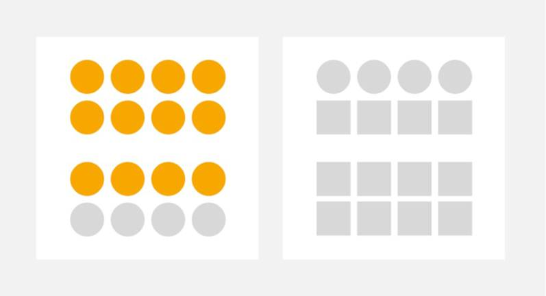
请这里需要注意的是，相近性作为第一条原则，它的「权重」非常大，大到可以抵消其他原则，比如为上面的圆形添加颜色，甚至改变其形状，人们也会把相近的事物当成一个整体。

##### 案例1
最常见的地方就在一些功能列表页面，比如设置，或者像微信的「发现」页面那样的功能列表页面。大家会把「扫一扫」和「摇一摇」、「购物」和「游戏」当成一个整体，这样可以使界面显得更加清晰，同时还能突出重点，这个列表的两头实际上是最突出的，像「朋友圈」和「小程序」。如果没有使用格式塔的相近原则，界面就会显得非常杂乱了。

##### 案例2

#### 二、相似原则
人们会把那些明显具有共同特性（如形状、大小、共同运动、方向、颜色等）的事物当成一个整体。比如下方第一幅图，大家会把同行的正方形当成一个整体，其他圆形当成一个整体。第二幅图，人们就会把大正方形当成整体，小正方形当成另一个整体。
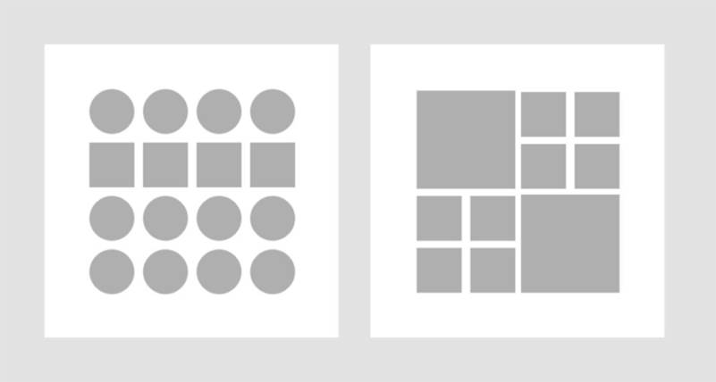

而这里需要注意的一点是人们对形状、大小、共同运动、方向、颜色的「感受权重」是不一样的，在这里颜色属性会覆盖其他属性的影响。
大家会把正方形当成一个整体，加了颜色后的右图，就变成竖列圆形+方形是个整体了。
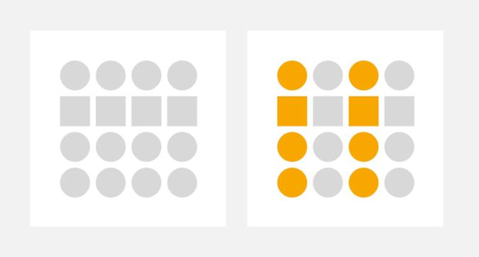

##### 案例3
我们的眼睛很容易关注那些复杂环境中外表相似的东西，这点在 UI设计中运用非常多，因为 UI界面中的元素非常多，可以利用相似原则组织好界面中的信息和层级关系。
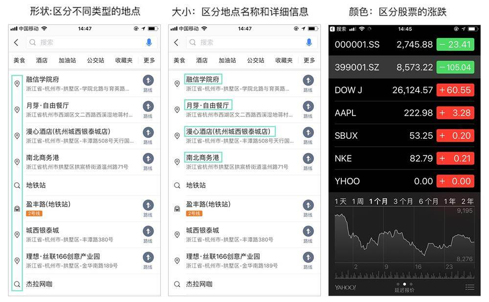

#### 三、封闭原则
人会将不完全封闭的东西当成一个统一的整体，所以有些时候完全闭合是没有必要的。 比如世界自然基金会的 Logo，就是一个典型地用到封闭原则的设计。熊猫的头部和背部并没有明显的封闭界限，但是我们依然会把它当成一只完整的熊猫。
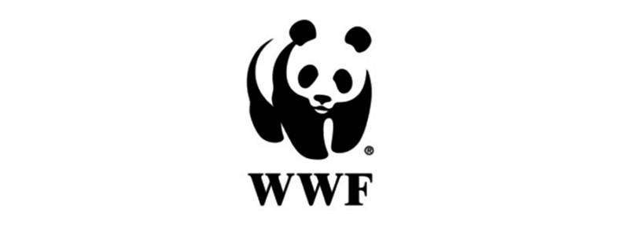

##### 案例4
这一原则其实很多地方都用到，不过我们一般不叫其为封闭性原则，而是叫截断式设计。为了让用户感知到还有内容，一般我们会使用截断式设计。像微信的钱包页面，底部因为屏幕大小的关系被截掉了部分内容，但是用户可以通过残留的部分，“脑补”出下方仍然有个完整的整体。

####　四、连续原则
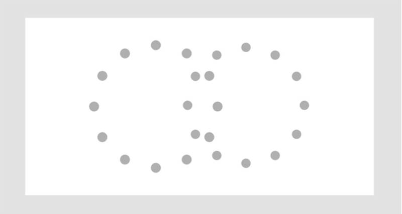
      人会将不完全封闭的东西当成一个统一的整体，所以有些时候完全闭合是没有必要的。
      大家觉得图里的是两个圆形呢？还是两个残缺圆和一个两圆相交的重合？
      按照格式塔原则，我猜大家看到的应该是上方左边的两个圆形吧。

人的视觉有追随一个方向上的连续性，以便把不关联的元素联系到一起
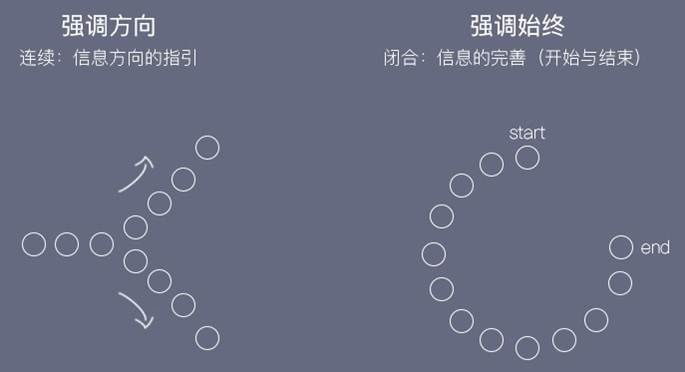

##### 案例5
这个法则我们在交互设计上用得比较少，但是在视觉设计中会用得多一点，比如某些应用就喜欢把 App Store 上的应用截图做成连续的图片。

##### 案例6
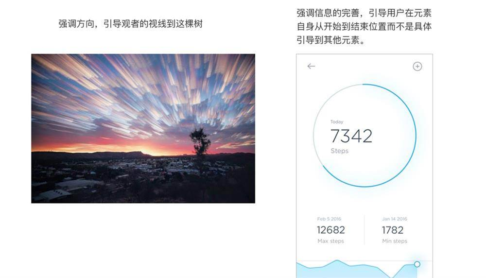

#### 五、简单原则
具有对称、规则、平滑的简单图形特征的各部分趋于组成整体。给大家看看一个例子：
左边的界面就是个对称页面，所以我们会觉得左边的各个卡片是个整体，下方还有一个新的卡片。但是右边的卡片就不是了，因为整个页面不是对称的，用户可能会疑惑右边是不是还有卡片。
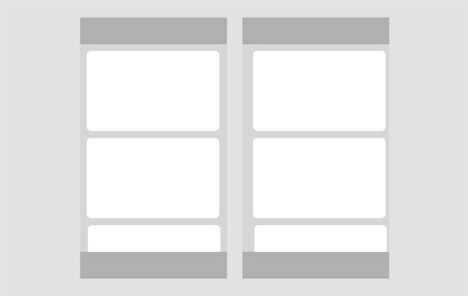

##### 案例7
简单原理适用于设计中的三角形构图，均衡构图，对称构图，向心构图，摄影中的对角线，X型构图等。这些构图方式都是为了把复杂的信息元素通过简单的方式让观者易于理解。
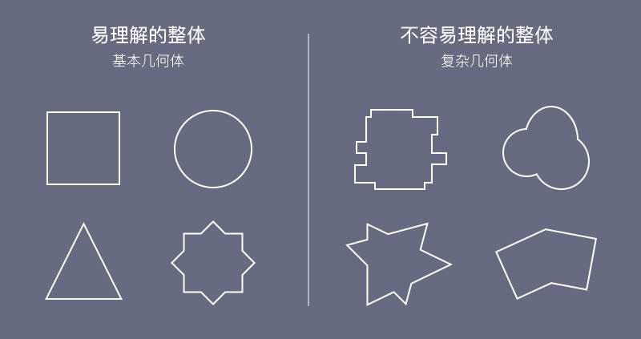

# 感谢观看
