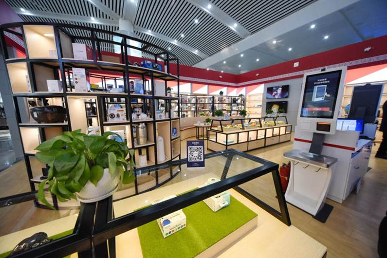
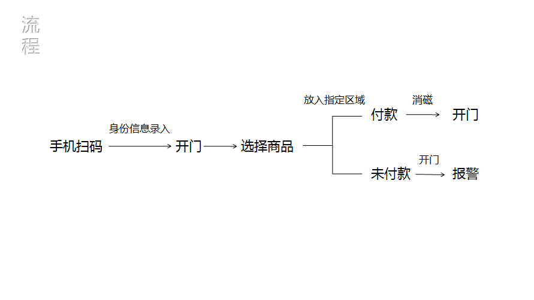
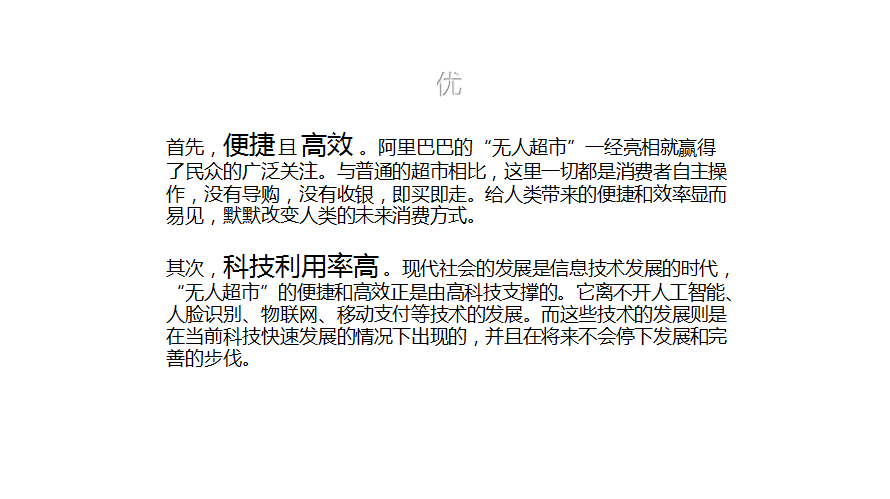
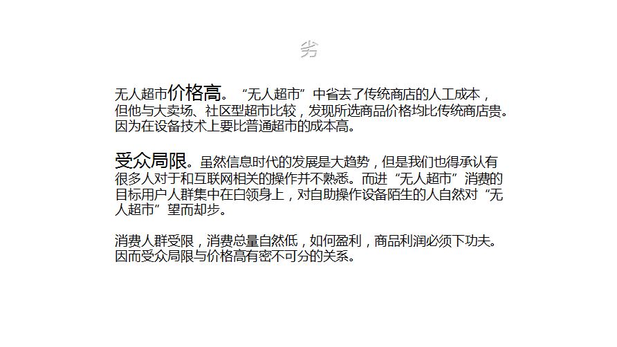
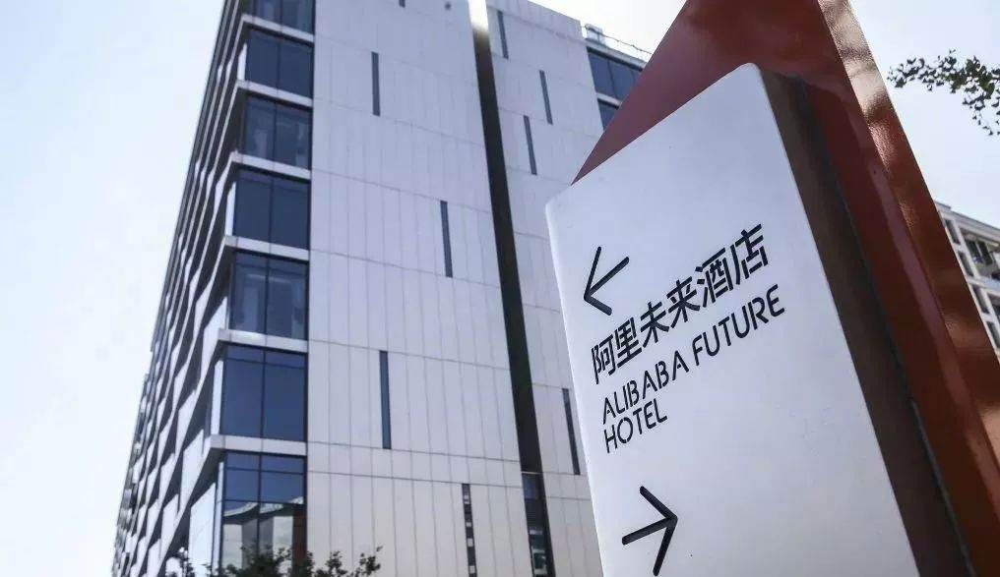
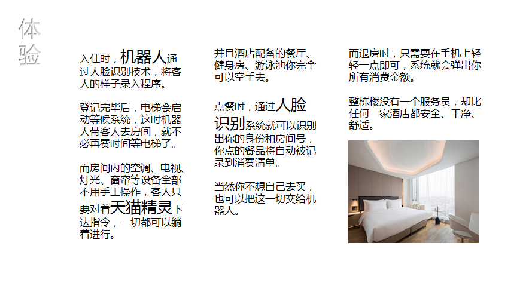
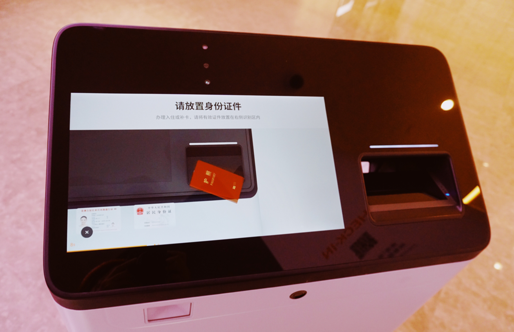
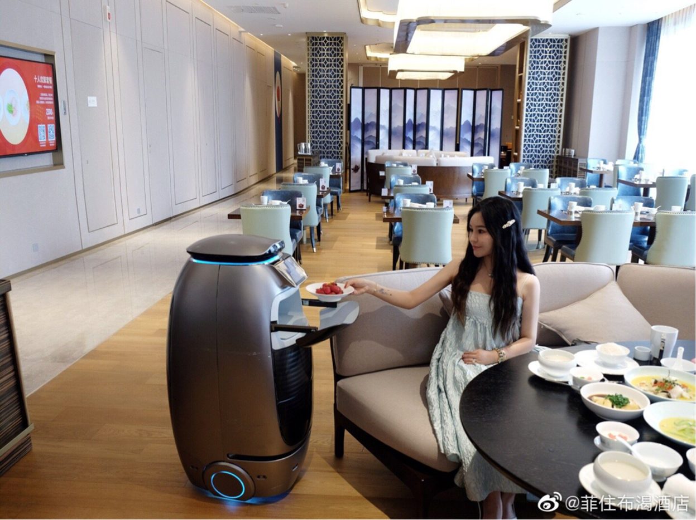
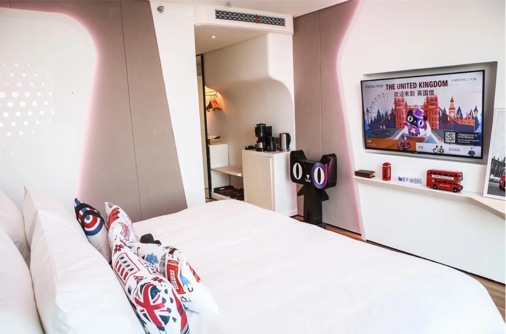
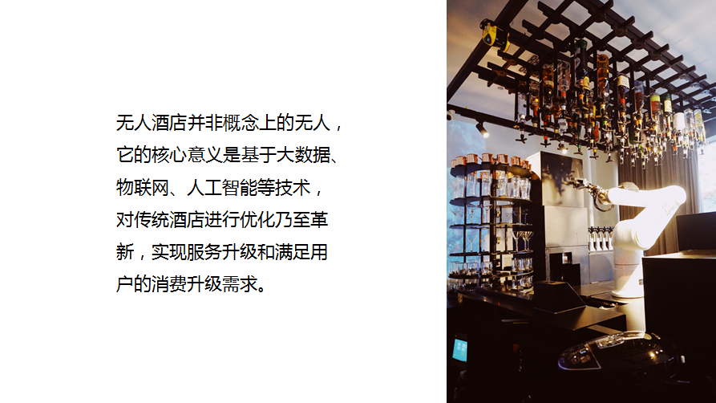

# 无人服务业    ——阿里的无人计划

高洁晴 编

## 一.无人超市

流程
原理
优
劣

从2017年  无人超市  引发的热潮
“无人超市”顺应时代的发展而出现，在全球各地已陆续出现，而在我国，则随着 马云 的“无人超市”引起了大家的关注。

无人超市依靠高科技实现

### 流程:

### 无人超市 原理:
如要进店，你需要用自己的手机扫码，将身份信息录入方可开门。刷过脸，门店就获取了你的绑定在手机上的身份信息，根据系统上填的信息，无人超市管理人员就能够分辨出那些优质客户。产品会贴上一个小标签。经过这个标签，不单超市的收银体系能够辨识你买的是什么货品，多少钱，还组成了门禁体系。

付款能够让标签消磁，机器辨识后方可解锁大门。反之，假设身上携带了没有付款的货品，机器读出后会响起警报，催促放回或付款。选好产品，将货品摆放到收银区域，作业途径上划定了一个区域以供辨认。只需物品没有堆出框，屏幕上很快呈现放置的物品称号和单价。扫出产品后，体系引导至付款页面，支付宝、微信支付等线上付出方法均可使用。

###    优：

###    劣：

## 二.阿里无人酒店=非住不可酒店？

菲住布渴阿里未来酒店

-- 杭州市余杭区乐淘城8号楼 --

### 体验：

### “无人酒店”的核心功能：
1.手机端预订，刷脸办理入住

通过线上预订，到店后凭借身份证或人脸识别自助办理入住，利用人工智能设备大大缩短了登记时间，提高办理入住效率。

2.取代传统人工，智能机器人服务

在无人酒店中，几乎见不到一个工作人员，取而代之的智能机器人就显得尤为重要，不仅为用户提供引导接待服务，顺畅热情的语音交互，给无人酒店增加了一丝温情，少了冰冷感。
此外，智能机器人的作用远不止接待、语音互动、带路那么简单。当客人在客房需加借物时，通过语音下达指令后，机器人便可送物上门。满足客人更多的服务需求，从细微之处提升服务品质。

3.取代房卡的智能门锁

随着智能门锁的普及，酒店实体房卡被淘汰是个趋势，毕竟比起携带房卡，无房卡更为方便些。目前主流的智能门锁有：二维码开锁、刷脸开锁、APP开锁、密码开锁、指纹开锁等多种方式。
阿里未来酒店是一家支持全场景刷脸住宿的酒店，当客人到达房前，刷脸即可进入客房。

4.无需手动操作，智能客房体验

在客房体验上，无人酒店多搭载智慧控制系统，无需房卡取电，进入客房后灯光、电视、空调、窗帘等设备无需手动操作，通过语音或人体感应自动开启调节。
智慧客房的大脑是“天猫精灵”，通过天猫精灵语音控制房内各个设备，比如：“天猫精灵，帮我关上电视”，即可关闭电视。
为客人提供更为便捷的入住体验。

5.手机一键退房，派单清洁客房
与传统酒店退房流程不同，无人酒店不仅入住体验智能便捷化，在退房上也同样高效。在阿里未来酒店免查房，通过手机即可快速退房离店，无需在大堂等待许久。

另外，对于无人酒店，人们最关心的是卫生清洁谁来做?在客人退房后，酒店会由系统派单，房嫂接单后前往客房进行标准化打扫，保证客房的清洁质量的同时，出房速度大大提升。

### 感想：
如今的时代是个大数据挖掘的时代，谁的手上掌握着大数据，谁就可以引领时代的步伐；
线上线下体验结合店，充分采用人工智能技术开发无人店，可以使更多的消费者在网上购买货物，而在网下进行更好的场景体验；
线下支付场景拓宽，当今的时代也是一个无现金时代，那么未来趋势肯定是继续深化持续创新；
我们要做的应该是抓住大数据时代的机遇，时刻紧跟时代时代潮流。

## Thanks