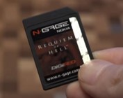
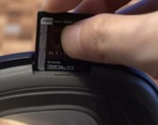
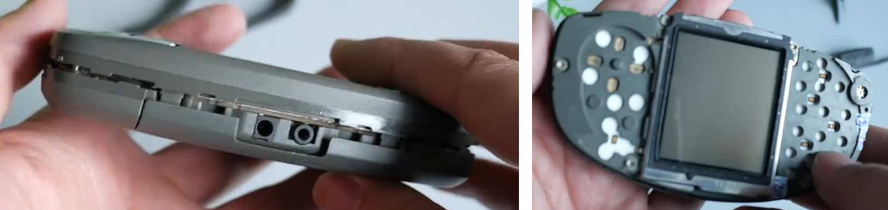
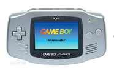
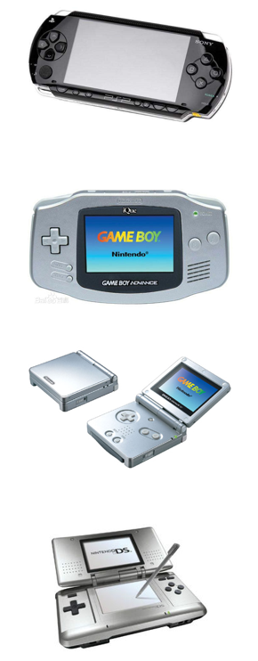

# 诺基亚N-Gage QD
>## 基本信息
### **上市时间**
2004年5月
### **类型**
游戏手机（诺基亚N-Gage系列的第二代，也是最后一代，之后的N-Gage作为游戏平台为诺基亚N系列手机使用）
### **系统**
塞班Symbian OS
### **颜色**
灰、橙、银
### **支持储存卡**
MMC卡（游戏卡亦为MMC卡）

>## 结构
类似于三明治，为两层卡壳，中间为手机主板，中框再由橡胶条包裹

>## 设计思路
N-Gage是诺基亚公司设计的游戏专用手机，拥有掌机的外形和操作机制，甚至还拥有游戏机才有的独占游戏，这是世界上第一款真正意义上的游戏手机，然而其市场定位的竞争对手是任天堂推出的GBA（Game Boy Advance），再加上各种各样的原因，这款产品并不成功。

>## 失败的原因
### **受众人群少**
目标客户为忠实的游戏爱好者，有手机游戏需求的人群也可以通过普通手机满足需求，没有必要专门购买游戏手机，而没有游戏需求的人就更不会购买此款产品。
### **价格问题**
2004年其在北美地区发售时的价格是299美元（约2500元人民币），而任天堂的GBA2001年的发售价格为9000日元（约600元人民币），与其他游戏机厂家相比也并没有价格优势。
### **自身竞争力不足**
**作为手机的方面：**  为了自身的游戏属性而阉割了部分手机功能，如立体声MP3、FM收音机、录音机等功能，再加上造型怪异，当时人们难以接受，遂在手机竞争中落于下风。

**作为游戏机的方面：** 与当时的便携式游戏机列强相比，此款机型存在性能不足，游戏画面粗糙的情况。在可玩游戏数量方面，N-Gage虽有育碧、世嘉、动视、THQ等游戏大厂支持，但游戏数量和质量方面相比其他游戏机厂商仍然不足（任天堂GBA全球销量8000万以上，拥有2000多款游戏，而N-Gage是300万，可玩游戏不足100款）

>## N-Gage的总结
### **1**
N-Gage虽然不算是合格的手机，也不算是合格的游戏机，却敢于将两者结合，开创游戏手机先河，这种创新精神值得肯定。
### **2**
相比于现在的游戏手机的那种并不明显的游戏属性，诺基亚在当时敢于拉拢游戏厂家，推出独占游戏，并制作游戏卡带，也许N-Gage才能算是真正的游戏手机，这也是此款产品被封为一代经典的原因。
### **3**
一个词总结“虽败犹荣”