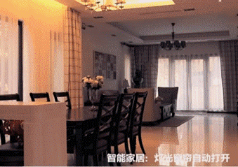

# 物 联 网 I O T

胡颖建 编

## 概 念 I
计算机+通信技术=互联网

互联网+移动通信技术=移动互联网

移动互联网+感知技术=物联网

通过红外感应器、全球定位系统、激光扫描器等信息传感设备，按约定的协议，把任何物品和互联网连接起来，进行信息交换和通讯，以实现智能识别、定位、跟踪、监控和管理的一种网络

有逼格点：简称IOT。全称为 Internet Of Things
（“物”通过互相交互才能组成所谓的物联网，收集管理利用数据或者信息，为人们的生活提供更多便利）

### 那么百度百科上的介绍？
物联网（The Internet of Things，简称IOT

是指通过 各种信息传感器、射频识别技术、全球定位系统、红外感应器、激光扫描器等各种装置与技术，实时采集任何需要监控、 连接、互动的物体或过程，采集其声、光、热、电、力学、化 学、生物、位置等各种需要的信息，通过各类可能的网络接入，实现物与物、物与人的泛在连接，实现对物品和过程的智能化感知、识别和管理。物联网是一个基于互联网、传统电信网等的信息承载体，它让所有能够被独立寻址的普通物理对象形成互联互通的网络

## 应 用  II
物联网七大应用

## 智能仓储和智慧物流 III
### 智 能 仓 储
智能仓储是物流过程的一个环节，智能仓储的应用，保证了货物仓库管理各个环节数据输入的速度和准确性，确保企业及时准确地掌握库存的真实数据，合理保持和控制企业库存。通过科学的编码，还可方便地对库存货物的批次、保质期等进行管理。利用SNHGES系统的库位管理功能，更可以及时掌握所有库存货物当前所在位置，有利于提高仓库管理的工作效率。
### 智 慧 物 流
IBM于2009年提出了，建立一个面向未来的具有先进、互联和智能三大特征的供应链，通过感应器、RFID标签、制动器、GPS和其它设备及系统生成实时信息的“智慧供应链”概念，紧接着“智慧物流”的概念由此延伸而出。与智能物流，强调构建一个虚拟的物流动态信息化的互联网管理体系不同，“智慧物流”更重视将物联网、传感网与现有的互联网整合起来，通过以精细、动态、科学的管理，实现物流的自动化、可视化、可控化、智能化、网络化，从而提高资源利用率和生产力水平，创造更丰富社会价值的综合内涵。同年，奥巴马提出将“智慧的地球”作为美国国家战略，认为IT产业下一阶段的任务是把新一代IT技术充分运用在各行各业之中。

井然有序--机器人能相互识别，并根据任务优先级来相互礼让。

智能充电--当机器人缺乏电力时也会自动归巢充电。

够多--上百台机器人，它们既协同合作又要独立运行

够大--机器人与拣货员搭配干活，一个拣货员一小时的拣货数量比传统拣货员多了三倍还不止。

### 视频与图像感知技术
由于此项技术需要人为操作，才能对图像进行分析，没有自动感应和识别功能，所以到现在为止还处在监控阶段。在对物流系统进行安防监控或物流运输过程中进行安全防盗时，经常使用该技术。由于该技术常与射频识别、GPS等技术结合使用，所以在物流系统中，该技术主要起到为其他感知技术提供辅助的作用。
### 传感器感知技术
同样，与视频与图像感知技术一样，常与射频识别、GPS等技术结合应用，用在对危险、食品、冷链等物流系统中的物品实况及当时环境进行感知。在仓储物流领域也存在其他少量使用的感知技术，包括扫描、红外、激光、蓝牙等，在自动化物流中心的自动输送分拣系统中会使用这些技术，主要是对物品编码进行分拣、自动扫描（不包括手持终端的条码扫描）、计数等工作。
### 射频识别技术
一种不用通过人为碰触，通过射频信号认识辨别商品并拿到相关数据的技术。射频识别技术可以认识辨别非常多的标签，并且物体在急速运动下也可以进行认识辨别，将货物变成可以定位、跟踪并且包装的“商品”，在商品配送、调拨、库存盘点、入库、移位、出库、生产等工作环节就会更加灵活和紧密，做到每个环节环环相扣，成为物流供应系统的技术基础。它在仓储物流业中的使用主要在下列方面：机场货运车辆的智能调度与管理，配送中心管理，道路货运车辆的跟踪与管理，航空集装设备、货物追踪及行李管理，托盘等装载设备的跟踪管理及货运集装箱追踪与管理。
### 无线网络与通信技术
仓储配送中心如果搭建无线网络系统，则可以借助4G无线通信技术。无线通信技术已广泛的地应用到仓储系统中。例如，如果省掉布线环节，就可以使用无线电子标签作为拣选系统的辅助作用，简化系统的建立。此外，实现仓储智能化作业，用无线通信技术完成实时通信和移动计算，这也是拣选车、叉车等移动设备的移动终端。
### 无人搬运车
无人搬运车也叫智能搬运车，跟随传感信息技术的发展，正向智能化方向前进。无人搬运车是物联网的一个重要组成部分。如果实现“智能物流”，无人搬运车必须成为一个具备“智慧”、可以自行辨别的物流终端，和物流系统中的物联网进行联网操作、智能工作。今后，智能搬运车（无人搬运车）也将跟随智能化技术的应用和物联网技术的发展，达到一个更高的领域。

## 物联网对物流和仓储的改变
### 过 去 ：
1、接收、入库、盘点、分拣均需人工或扫码操作;　　
2、现场人员多，劳动强度大，数据易错;　　
3、货物收发货日期、数据等需要人工记录，不准确;
### 现 在：
1、实现出入库、盘仓、数据报表等物      流操作远程、可视化;　　
2、收货环节减员增效;　　
3、实现快速出库、分拣找货;　　
4、准确及时库存日期预警;
## 智能家居 IV

智能家居是将居民住宅作为平台，通过网络通信技术、自动控制技术、综合布线技术、音视频技术以及安全防范技术等与家居生活融合为一体，能够增强家居的便利性、艺术性、安全性和舒适性。智能家居系统指的是将家居功能实现全智能自动化

### 网络传输技术

网络传输技术能够覆盖到家庭生活的各方面，能够为各种智能服务提供互联网服务系统，主要包括家庭网关和家居设施等。家庭网关主要是对各种家居设备互联或者网络接入等进行管理，能够为家庭用户构建远程控制平台，还能够使各种家居设备的信息实现共享。
### 传感器技术

传感器技术是智能家居中最为广泛和实际的应用，例如: 对门窗闭合状况采用磁传感器进行监控;烟雾和可燃气体传感器能够对室内火灾状况或者毒气泄漏进行检测; 温度传感器能够对室内采集设备和温度进行监控; 无线空气传感器和光线传感器能够对室内的空气防尘、防污染和光线照明亮度进行探测。对于采集到的传感器数据，目前常使用数学规划和优化技术的方法、信息论的方法、知识或专家系统的方法等对数据进行分析。
### 信息处理技术

智能家居系统追求高度人性化，而且就像是企业中的人力资源管理一样，原则是以人为本。不管是辅助生活行为、改造生活环境，还是对主人身份进行识别、对家庭进行安全防范、对主人行为进行预测以及对主人状态进行判断，都是智能家居系统的前提和必备，也能够真正体现“智能”原则。其信息处理过程的实质就是对各类采集到的信息二值化后，进行特征提取。
### 无线红外线放闯入探测器

无线红外防止闯入探测器应用功能最主要的是防止非法入侵者，例如:按下床头无线睡眠的按钮之后，会启动自动防止无线红外闯入，一旦出现入侵情况就会立刻报警，这样就能够将入侵者吓退。当室内主人不在家时也会自动设防，有人闯入时会利用无线网关提醒手机，手机会自动发出警情处理的指令，室内设防器就会接收到。
### 无线湿度传感器

这个传感器主要是对室内外温湿度进行探测，尽管大部分的空调都会有自动探测温湿度的功能，只能对空调出风口位置附近温湿度进行探测，而无线温湿度探测器能够准确对室内温湿度进行探测，室内温度一旦过低或者过高，就会提前将空调启动对室内温湿度进行调节。当主人在室内感觉不到户外温度，此时墙壁外温湿度传感器就会发挥功效，提醒户外实际温湿度。
### 无线空气质量传感器

这个传感器主要是对室内外温湿度进行探测，尽管大部分的空调都会有自动探测温湿度的功能，只能对空调出风口位置附近温湿度进行探测，而无线温湿度探测器能够准确对室内温湿度进行探测，室内温度一旦过低或者过高，就会提前将空调启动对室内温湿度进行调节。当主人在室内感觉不到户外温度，此时墙壁外温湿度传感器就会发挥功效，提醒户外实际温湿度。

现在大多数智能家居系统还未形成物联网系统(网关），只是其中某些物联网技术被应用。本文以感知技术为例具体讲述基于物联网技术环境下的智能家居的应用实现。

## 浅谈5G物联网

## END