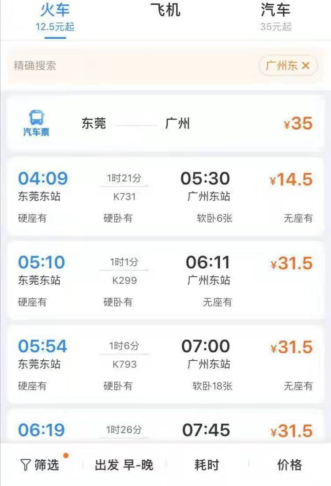

# 网络订票软件的开发过程和特点   

## 软件开发流程一般分为以下六步：
1 相关系统分析员和用户初步了解需求，然后用WORD列出要开发的系统的大功能模块，每个大功能模块有哪些小功能模块，对于有些需求比较明确相关的界面时，在这一步里面可以初步定义好少量的界面。

2 系统分析员深入了解和分析需求，根据自己的经验和需求用WORD或相关的工具再做出一份文档系统的功能需求文档。这次的文档会清楚例用系统大致的大功能模块，大功能模块有哪些小功能模块，并且还例出相关的界面和界面功能。

3 系统分析员和用户再次确认需求。

4 系统分析员根据确认的需求文档所例用的界面和功能需求，用迭代的方式对每个界面或功能做系统的概要设计。

5 系统分析员把写好的概要设计文档给程序员，程序员根据所例出的功能一个一个的编写。

6 测试编写好的系统。交给用户使用，用户使用后一个一个的确认每个功能，然后验收。

## 系统需要实现如下主要功能以及相关说明

信息查询：站与站的汽车票信息查询、车次的查询以及用户已经订票的信息查询。

预定：在规定的有效时间段内，预定车票，收取费用。

退订：在车票的有效期之内，能够对所预定的车票进行退订。

## 模块分区

1.注册功能模块：对于想利用本系统进行车票查询的用户，首先需要注册成为系统的用户才能进行查询，系统保存用户的注册信息，在注册用户是仅需要输入用户自定义的用户名称和密码，注册成功后页面转入登录页面。

2. 登录功能模块 ：用于用户的登录，对于已经在本系统注册的用户可以根据注册时所用的用户名和密码登录到系统，但是用户名和密码必须正确，若不正确，系统会进行提示错误，确认后进入查询页面。

3. 查询功能模块：查询分为站与站的查询，车次的查询以及已定车票的信息查询。用户在查询页面输入框输入所要查询的出发站和目的站，或者是车次，系统会根据输入的信息进行搜索，并给出结果，用户还可点击搜索结果查看票的详细信息。

4.订票功能模块：用户在查询界面查询到自己满意的车票时，可进行网上购票操作，所订车票将自动添加到用户的个人信息中，方便用户以后进行管理。

5. 管理功能模块：只有登录成功后的用户才可以管理自己的信息，在个人信息框中可以查看到用户已订的车票和用户注册时所填的个人信息。用户由于某些个人因素需要退票的还可以进行退票。

## 系统需要实现如下主要功能以及相关说明
信息查询：站与站的汽车票信息查询、车次的查询以及用户已经订票的信息查询。
预定：在规定的有效时间段内，预定车票，收取费用。
退订：在车票的有效期之内，能够对所预定的车票进行退订。

## 系统流程图
系统管理员以及系统用户操作处理流程

信息查询流程

退票处理流程

## 网上订票优势

1 查询方便（网络订票与传统的售票方式最大的不同之处就在于不需要现场去排队，只要鼠标轻轻一点，足不出户就能知道你所要前往的线路是否还有剩余车票，不至于排了半天队，还是没买到票。）
2 付款方便安全（采用了支付宝，它们通过信息数据的处理就免了购票者来回奔波的痛苦。而且安全的问题也得到了解决，像支付宝这种第三方支付平台，让购票者很是放心。）
3 拿票方便（订到票后，可享受到快递公司送票上门的优质服务）

## 网上订票特点
网上订票与传统网上、电话订票的最大区别在于，它是一个完整的售票平台，而非预定，使得每一台可上网的电脑或每一部手机都可以成为客运公司的售票终端，从而实现了客运公司的售票点布向到每一个人，真正意义的实现了电子售票。

电子化:网上订票改变了百姓出行的传统观念，符合票务发展的最终趋势;

无纸化:运用网络进行订票操作，提倡环保理念，降低了客运行业运营成本;

预约化:可以提前进行车票的购票，解决了节假日客流高峰期百姓出行难的问题，且实现方便快捷的出行要求;

实名化:网上订票采取实名制操作流程，帮助政府针对流动人口实现安全、有效的管理，从而促进和谐社会的发展。

