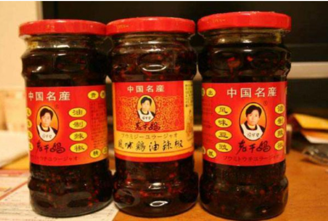

# 现在的老干妈怎么了？

李裕航 编

## 老干妈的历史

老干妈的创始人———陶华碧。

 “老干妈”的由来： 1989年，陶华碧用省吃俭用积攒下来的一点钱和四处捡来的砖头盖起了一间简陋的餐厅， 专卖凉粉和冷面。为了佐餐，她特地制作了麻辣酱，生意十分兴隆。有一天，陶华碧起 床后感到头很晕，就没有去菜市场买辣椒。谁知顾客来吃饭时，一听说没有麻辣酱转身 就走。这件事对陶华碧的触动很大。 她一下就看准了麻辣酱的潜力，从此潜心研究起来。经过几年的反复试制，她制作的麻 辣酱风味更加独特。很多客人吃完凉粉后，还买一点麻辣酱带回去，甚至有人不吃凉粉 却专门来买她的麻辣酱。后来，她的凉粉生意越来越差，而麻辣酱却做多少都不够卖。一天中午，她的麻辣酱卖完后，吃凉粉的客人就一个也没有了。她关上店门，走了10多 家卖凉粉的餐馆和食摊，发现他们的生意都非常好，因为这些人做佐料的麻辣酱都是从 她那里买来的。从那之后，她再也不单独卖麻辣酱。 经过一段时间的筹备，陶华碧舍弃了苦心经营多年的餐厅。
 
 1996年7月，她租借贵阳市南 明区云关村委会的两间房子，招聘了工人，办起了食品加工厂，专门生产麻辣酱，定名为 “老干妈”麻辣酱。 办厂之初的产量虽然很低，可当地的凉粉店还是消化不了，陶华碧亲自背着麻辣酱，送到 各食品商店和各单位食堂进行试销。不过一周的时间，那些试销商便纷纷打来电话，让她 加倍送货。一年后，“老干妈”麻辣酱经过市场的检验，在贵阳市稳稳地站住了脚。

 1996年7月，陶华碧借南明区云关村委会的两间房子，招聘了40名工人， 办起了食品加工厂，专门生产“老干妈麻辣酱”。 陶华碧和工人一起做工，什么事情都亲历亲为。当时的生产都是手工操作， 其中捣麻椒、切辣椒时溅起的飞沫把人的眼睛辣得不停地流泪，工人们都 不愿干这活。陶华碧就亲自动手，她一手挥着一把菜刀，嘴里还不停地说： “我把辣椒当成苹果切，就一点也不辣眼睛了。” 1997年8月，“贵阳南明老干妈风味食品有限责任公司”正式挂牌，工人 一下子扩大到200多人。 2018年10月，被中央统战部、全国工商联推荐为改革开放40年百名杰出民营企业家。

 在十一届全国人大五次会议上，中国著名辣椒制品 品牌创始人“老干妈”陶华碧表示：“‘老干妈'3 年缴税8个亿，实现31亿元人民币的产值，带动两 百万农民的致富，我还是按照我的知识来办事“。 2016年两会，贵州团代表“老干妈”陶华碧请假， 因为身体原因，没有来北京参加全国人代会。 2017年全国两会，陶华碧再度因身体原因缺席。

 ## 以往的老干妈

 陶华碧老干妈牌油制辣椒是贵州的风味食品。几十年来，  一直沿用传统工艺精心酿造，具有优雅细腻，香辣突出， 回味悠长等特点。是居家必备，馈赠亲友之良品。
 
  老干妈是国内生产及销售量最大的辣椒制品生产企业， 主要生产风味豆豉、风味鸡油辣椒、香辣菜、风味腐乳 等20余个系列产品。

  
  
  在大多数国外购物网站上老干妈都 直接译成"Lao GanMa"， 也有译成"The godmother"。 2012年7月，美国奢侈品电商Gilt 把老干妈奉为尊贵调 味品，限时抢购价11.95美元两瓶（约人民币86.3元）。 美国“老干妈”绝对算的上是“来自中国的进口奢侈品”。

  ## 如今的老干妈

  “老干妈”不再是以前的老干妈了？原因是什么呢？
  
  原因一：辣椒这一主要材料换了。原本使用的是贵 州遵义的辣椒，由于遵义的辣椒价格涨得太高、太 快了，如果老干妈继续用遵义的辣椒来作为原材料 的话，那是根本挣不到钱，没法盈利的。所以后面 他们就换了别家的几块钱一斤的辣椒，拿来作为原 材料，这也就是为什么现在的老干妈的味道远不如 从前的其中之一的原因了。

  原因二：以前的老干妈只有一种， 3 那就是大家都很爱的辣子鸡口味 的。但是现在出现了很多种类： 老干妈辣子油、老干妈豆豉油等 等。然而这么多种类的老干妈， 它们的外包装又做的都差不多， 有很多人买的时候没有仔细看， 随便拿了一瓶，就以为是以前自 己吃过的味道的老干妈。但是拿回家 之后吃了却发现，不是以前自己喜欢吃的那种口味了， 就十分的伤心，也就导致大家觉得老干妈没以前好吃了。

## 总结

老干妈的成功归结于陶华碧女士的匠心精神。从无到有， 一步步走向国民品牌靠的是她坚持做好辣椒酱，遵循国家的纳税。 正如她本人表示的：“‘老干妈3年缴税8个亿，实现31 亿元人民币的产值，带动两百万农民的致富，我还是按 照我的知识来办事“。 

 如今老干妈的地位不在是以往的独一无二的辣椒酱了， 现在市面上很多口味与老干妈相当的辣椒酱， 以飞快的速度占领市场，主要原因是在包装上的改变， 现在的人们审美在不断提升，对于产品的第一印象还是在外观包装上。 老干妈的包装几乎没有变化，这在当今飞速发展的社会中其地位会急剧下降。