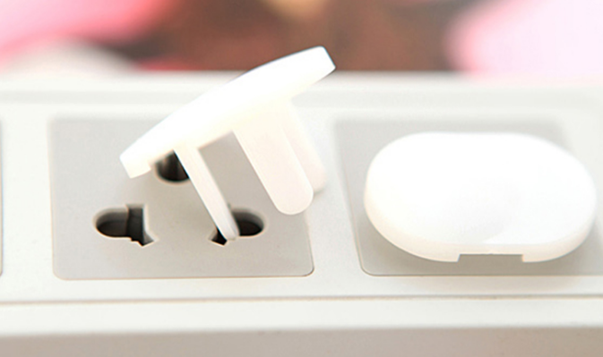
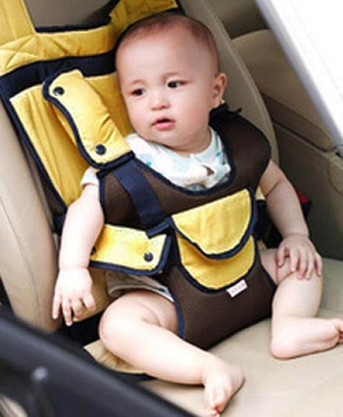
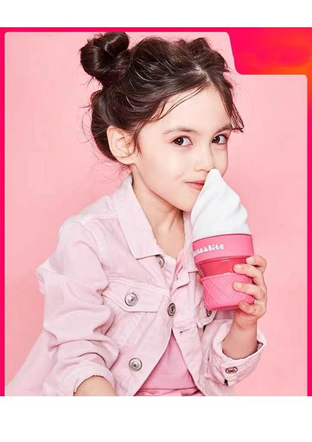
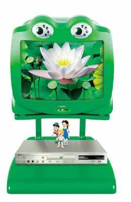
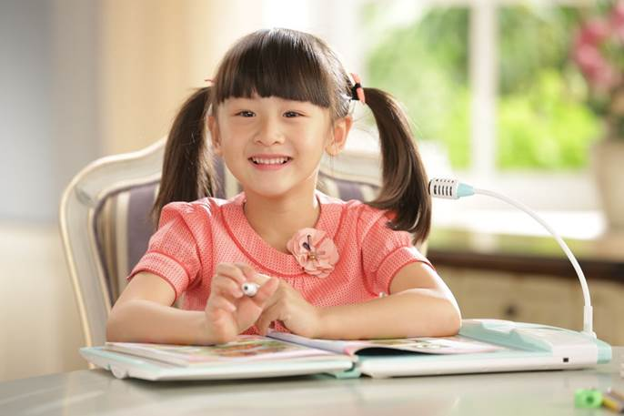

# 儿童产品设计
## 引言
         儿童产品是一个具有恒久生命力的市场，设计师肩负的责任重大。随着社会的进步，设计师们该如何实现对儿童这个特殊群体的无微不至的人性关怀，儿童是人类的未来，因此对他们所做的设计会显得更加重要。
## 1：儿童产品设计原则
 
## 2：儿童产品分析
# 儿童产品设计原则
安全性
易用性
趣味性
 # 安全性
在儿童玩具的安全性设计中, 需遵循以下原则, 一是人性化设计原则, 即依据儿童心理、生理发展特征, 设计出适合相应年龄段的玩具产品;二是科学性设计原则, 即注重人机工程学在儿童玩具安全设计中的应用。人机工程学依据儿童身体测量的资料, 考察有代表性的样例, 掌握第一手自己的测量数据, 其中包括儿童的生理数据、生活方式、文化模式等, 为设计师提供更加科学的依据, 这样设计师能够更好地了解和预测儿童、玩具、环境之间的关系, 从而增进玩具的安全性;三是绿色设计原则, 儿童玩具设计中的绿色成分重点突出“生态意识”、“环境保护”、“绿色无毒”等设计观念, 包括安全性、节能性、生态性特征。
# 易用性
儿童的思维是比较单纯的，其逻辑思维、注意力、记忆力等方面发展尚未完全成熟，儿童的耐心也常常不足，如果一件产品的界面设计过于复杂，使儿童望而生畏，或者操作起来比较繁琐，他们往往会转移注意力、甚至产生挫败感，不再愿意亲近该产品。要提高儿童产品的易用性，这就需要在力求产品操作界面简洁化的同时，巧妙的对产品符号进行视觉化。简洁、单纯的东西让人一目了然、一看就懂、一学就会，一个按键就可以完成的工作，不必要设计成两个或者更多个按键。这样的产品往往也是用起来十分方便的东西。而视觉化的产品符号比较直观，方便了操作，同时也可以引起儿童的联想，提高儿童的想象力和创造力。易用性的儿童产品展现了良好的产品人机界面的人性化交流和沟通，使产品不仅易于学习使用，而且能够满足他们的生理和情感的需要。
# 趣味性
         人性化设计要满足人的情感需求。因为人是有感情的，在使用产品时，人们希望能和产品进行良好的沟通。对于儿童来说，儿童天生情感丰富，他们喜欢接近一些宜人性和具有亲和力，或是充满生命力的趣味产品。因此，一些色彩绚丽、造型夸张、卡通化；或模仿动物造型的儿童产品，通常容易吸引儿童的注意力，能使他们获得精神的愉悦，满足他们的心理需求。
## 儿童产品分析
# 儿童安全插座

1-2岁好动宝宝喜欢关注细微事物、到处乱戳，儿童安全插座能双层封闭，双层保护;它采用立体芯保护门，插孔全部遮盖。白色的保护门遮挡插孔，能最大程度的减少宝宝对小孔的注意力。
2-6岁好奇宝宝越长越强壮，儿童防触电插座创新结构设计、精心选材，让带电孔保护门可承受10千克的重力，比普通保护门6千克的承重力更可靠。
# 儿童安全坐垫
 

         孩子的天性总是活泼好动的，常常在行车的路上喜欢到处扭来扭去，家长们为了避免他们捣乱，也处于安全考虑，就给他们系上车上已有的安全带。殊不知，安全带贴紧儿童的颈部貌似不会有问题，但如果真的发生交通事故，儿童反而会被它勒住脖子。因为汽车突然停止时，儿童的头就会向前倾，这时安全带就会更多地偏移到脖子处。另外，在交通事故中，安全带斜角部分可能会向下滑，儿童就有可能从它的上部被抛出去。
# 冰淇淋儿童水杯
 
         冰淇淋的造型，颜直高的同时更具趣味性，更能吸引儿童的喜爱。
# 海尔“青蛙王子”
 
国内第一台儿童专用电视——海尔“青蛙王子”亮相岛城各大商场。新奇的功能、卡通形象的外观、儿童熟悉的名字，产品一上市便受到广大小朋友及家长的喜欢。一些专门到商场为孩子购买青蛙王子彩电的家长认为，现在市场上关于开发儿童智力的产品很多，但在专门为儿童设计的彩电这一方面还是个空白，因为
孩子从生下来就开始接触电视，所
以电视对孩子的启发、引导、特别
是在保护视力方面我们家长非常关
心海尔推出的这个产品正是我们需
要的。
# 步步高点读机
 
         “哪里不会点哪里”,步步高点读
机是步步高教育电子有限公司生产
的一种学习机，主要针对儿童学习
英语使用，也可以学习语文数学等
科目。简单的操作更能辅助儿童的
学习。
