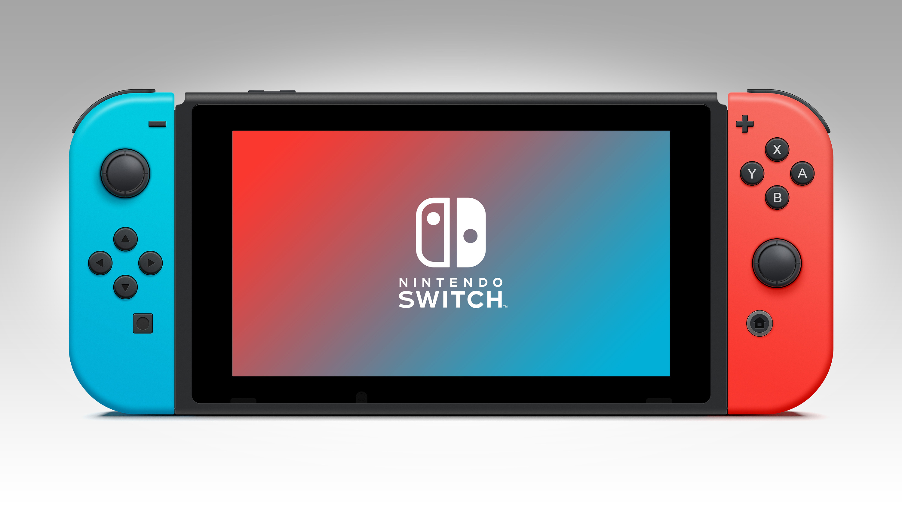

# Nintendo Switch
### 任天堂的品牌故事
任天堂（Nintendo）是一家主要从事电子游戏软硬件开发的日本公司，电子游戏业三巨头之一，现代电子游戏产业的开创者。任天堂创立于1889年9月23日，最初以生产花札起家，1970年代后期投入电子游戏产业，并于1983年推出了第一代家用游戏机FC。
    任天堂以“创造独特的娱乐方式”为基本方针， 以“为所有和任天堂产生联系的人们带来笑容”为企业社会责任， 开发了诸如马里奥、精灵宝可梦、塞尔达传说等知名游戏系列 ，FC、SFC、N64、NGC、Wii、Wii U、Nintendo Switch等家用游戏机以及Game&Watch、GB、GBA、Nintendo DS、Nintendo 3DS等掌上游戏机。

### SWITCH是任天堂旗下的一款游戏主机

“Switch”的英文字面解释为开关和切换，显然后者更应该是任天堂这台全新主机所想要诠释的定义。 其最大的特征就是同时具备携带和家用两种特性，同时又针对手柄控制器进行模块化设计的全新形态游戏主机。 家用机和携带掌机一直是支撑任天堂经营业绩的两大支柱，NS等同于将该社过去的两条产品线合而为一。对任天堂来说，以后不再有主机和掌机两条产品线， 对于开发者来说可以摆脱双线奋战的困扰，更加专注的开发游戏。主机和掌机的身份可以随时无缝切换（Switch），这正是任天堂为NS所下的定义。

## Switch的两位前辈

> 分别是作为家用主机的WII-U和掌上游戏机的Ninetendo 3DS系列和2DS系列
> 而3DS卖的很好，WIIU的销量非常惨淡。

## 结合了两者部分功能的SWITCH

Nintendo Switch 是一部模块化的主机掌机二合一设备，它拥有一块6.2英寸720p分辨率的电容式触摸屏，两侧的可拆手柄以及背后可伸展的的支架。其中首发配色有黑灰以及红蓝撞色两种。

### Joy-con手柄
Nintendo Switch 拥有一对可以分拆的手柄，名字叫做 Joy-Con。 Joy-Con 平时装在主机两侧，当你需要在电视上玩游戏时，你可将其拆下，装入握把中，这样就能像一般的游戏手柄那样握持了。不过，你也可选择不用握把，直接在分拆的状态下玩游戏。 
    两侧的 Joy-Con 能作为单独的控制器，用来进行 2P 双人游戏。你可与好友随时随地对战，来一盘《马力欧赛车》或《街头霸王》，不需要另外购买其他配件。 Joy-Con 的续航时间约 20 小时，插入机身本体可自动充电，完全充满需约 3 个半小时。

### 双模式切换
Switch可以将本体通过连接底座，底座连接显示屏的方式切换成为主机模式，此时Switch本体上左右两侧的可拆卸式手柄joy-con可以从两边向上提拉出来并通过手柄组合组件组合成一个完整的手柄，这样就从掌机模式切换成为主机模式，体现了switch命名的意义，是一种十分有创新性的模式。

##Switch是怎样扭转前代wiiu的失败的呢?

### 大胆的跨界
Switch 畅销的第一个原因是 Switch 的核心理念，即可以随时随地游玩的主机，不少玩家对这种理念已经期望了太长时间，如今任天堂率先实现了这个想法。
### 强力的护航大作
第二个原因是 Switch 出色的游戏阵容，不得不说《塞尔达传说：荒野之息》《spulatoon2》这样的开场着实强悍。

>《塞尔达传说：旷野之息》（ゼルダの伝说： ブレスオブザワイルド）是由任天堂企划制作本部与子公司Monolith Soft协力研发制作的一款开放世界动作冒险游戏。于2017年3月3日由任天堂发行，为《塞尔达传说》系列游戏正统续作的第15部作品。
    该作于2017年12月8日获得TGA年度游戏、最佳游戏设计和最佳动作冒险游戏 ；2017年12月23日获GameSpot年度最佳游戏；2018年1月5日获EDGE年度最佳游戏；2018年3月24日获得GDC最佳游戏音效奖、最佳游戏设计奖和年度游戏奖 ；2018年3月18日获得SXSW最佳游戏性奖、最佳游戏设计奖和年度最佳游戏。

### 第三方支持
第三个原因是良好的第三方支持，Switch 平台的游戏不仅有 EA、育碧之类的大公司加持，也有许多优秀的独立开发团队支持。

## 最后

