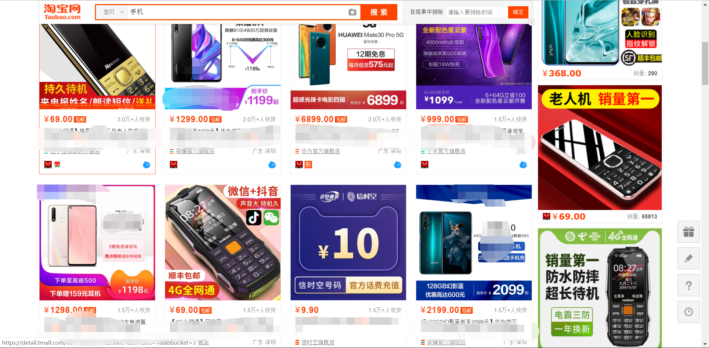

# 从众心理

## 目录
1.什么是从众心理
2.从众心理对设计有什么好处？

### 一、什么是从众心理

从众心理（conformity behavior），指个人受到外界人群行为的影响，而在自己的知觉、判断、认识上表现出符合于公众舆论或多数人的行为方式，而实验表明只有很少的人保持了独立性，没有被从众，所以从众心理是部分个体普遍所有的心理现象。

### 二、从众心理对设计有什么好处？
从众心理，在营销起到非常重要的作用，但一个产品设计中，设计师更要考虑如何才能利用从众心理结合外观设计、结构设计使产品销量更高；在产品生产之后，广告设计上也要考虑如何利用人们从众心理设计出广告使他们心肝情愿地掏腰包。

#### · 产品设计时如何运用从众心理

其实工业设计产品的最终目的是使产品卖得更好，在设计的前期我们可以做一系列的调研，就是为了让产品更容易让客户掏钱。
从众心理就是其中的一点，我们调研是往往要去某宝、某东、某某逊去查看你将要设计的同类产品最热销的几十款的特点，去了解为什么人家能除了广告营销，还有能让人从众的产品设计的点。

##### · 广告设计如何运用从众心理

在广告中营造或炒作“热销”假象，往往就会造成真正的热销结果。广告宣传的舆论导向“火热”，大众就容易跟着“热”，有从众心理的人常就会跟着“凑热闹”。
拼多多的广告语“3亿人都在拼的购物APP”，把自己的品牌炒热，引起大众关注，从而达到宣传与营销的目的。这就让消费者产生了一种“这么多人都在使用的购物APP，那产品应该还不错”的心理暗示。
香飘飘奶茶的“连续六年全国销量领先，一年卖出十亿杯，杯子连起来可绕地球两圈”的广告语也是运用了从众效应。通过“地毯式轰炸”般地投放广告，香飘飘成功霸占了人们的视野，已经成为了家喻户晓的奶茶品牌。

