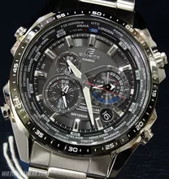

# 卡西欧G-SHOCK

## 企业文化(背景文化）

•卡西欧手表是日本三大品牌之一

•多年来以真正多功能的G-SHOCK手表著称于世。

•它所代表的活力、年轻、时尚、多功能的品牌形象已深入民心。

•卡西欧公司一向以技术领先于同行为己任历年都会有技术的突破。

•将高，精，尖的先进科技结合新型液晶技术，恰当地运用于腕上时计。

•它不断地提高腕上时计的发展水平——卡西欧一贯以来所倡导的“腕上科技”精神在中国也被得以沿袭和传播。

## 市场分析

******

卡西欧手表市场SWTO分析

## 产品简介

基本信息

•中文名称：卡西欧G-SHOCK

•品牌：卡西欧

•型号：G-SHOCK

•特点：抗震概念和强大功能设计

卡西欧G-SHOCK是卡西欧的一款，具有傲人的强悍耐用、防水等特点。 SHOCK是打击冲击的意思，在医学上是休克之意。前面的G代表重力gravity。1983年，卡西欧G-SHOCK手表以创新，抗震概念和强大功能设计， 卡西欧G-SHOCK的抗震传奇已经进入第35年，G-SHOCK一如卡西欧一贯以来所倡导的"超越梦想，挑战极限"的品牌精神将不断被沿袭和传播。

G-SHOCK被创造出来，源于一个简单的信念:创造一个永远不会摔坏的手表。近年来，在秉承"永不摔坏的手表"的信念下，不断进行革新。当年三个10的目标已经被远远超越。在设计上的每一方面都考虑坚固，G-SHOCK继续向新的未知领域不断挑战。这种持续钻研的态度，不仅创造了新的防震结构，同时也开发出很多先进科技成果，包括整合了电波接收和太阳能技术的G-SHOCK.

## 功能结构

### 功能分析

G-SHOCK是卡西欧最为著名的腕表系列。遵循”永不摔坏的手表”的理念，是真正的多功能腕表。

G-SHOCK的陆地系列具有防泥、防磁、电子罗盘、世界时、温度测量等功能，还具有自动背光照明，低电量警告灯辅助功能。

海洋系列具有200米防水、潜水记录、自动发光灯功能，而极限运动系列除常规最大的特点防震外，还能抵抗-20度的低温天气。

卡西欧不断提供各种创新产品，如测量脉搏的手表和带GPS功能的手表等，从而实现对社会的贡献。卡西欧总是关注每一个消费者，为实现“个人多媒体”的目标而努力。

### 结构分析

折叠机芯悬浮结构
(Hollow case construction)

机芯悬浮于表盘中，只有几个连接点与外壳链连接，缓解冲击，从而实现对机芯的防震。

折叠全方位防震结构
(All-directional guard structure)

手表设计了一个很突出的外框，当手表以任何角度掉落时，都能保护按钮和表盘不直接接受到撞击。

折叠防震的表带结构
(Shock resistant band shape)

手表与表带的连接处呈弯曲状固定，表带成为一个缓解冲击的构件，当手表遇到正面冲击时，它可以缓解大部分撞击力，把手表反弹回来。

## 优势与劣势

优势：

将高，精，尖的先进科技结合新型液晶技术，恰当地运用于腕上时计，不断地提高腕上时计的发展水平功能强大，潮流时尚，深受现代年轻人喜爱防震防摔，深度防水。

劣势：

黑色系列为主，整体不够精致，略显笨重手表修理次数相对频繁，卡西欧应当针对这个对手表功能质量进行强化，以过硬的技术保证手表的耐用度。

