# Sennheiser森海塞尔（声海）
## 学号：20160304430224
## 姓名：邱玉吟

## Part one 百度百科
## Sennheiser森海塞尔（声海）
### 声海(原名:森海塞尔)，由Prof. Dr. Fritz Sennheiser(弗里茨·森海塞尔博士，1912年5月9日~2010年5月17日)于1945年创立的森海塞尔是世界公认领先的专业话筒和耳机制造商。森海塞尔不断地引领着新的音频技术的潮流，研究开发中心在德国汉诺威。它也是业界公认的无线电、红外声传输技术、听诊式耳机、航空通话耳机、多媒体传播、呼叫中心耳机和头戴式耳机的先驱。
### Sennheiser(森海塞尔) 这个源自德国的品牌是高保真耳机领域里最有名望的，发烧友几乎尽人皆知，历史长达50多年。它的动圈式耳机以中档Super-aural型的400系列和高档Circum-aural型的500系列为主。其中顶级型号HD800是当今最佳动圈式耳机之一，HD580也是大名鼎鼎的经典设计，仅次于HD800,HD700,HD650和HD600。森海塞尔的总体声音风格是:透明、细腻、平衡，偏向冷色调，重播古典音乐声音极为准确，但播放低频成分较重的电子摇滚乐、舞曲时不太合拍，重播人声则略显冷漠。

## Part two 发展史
##  前身
### 1945年5月的一天，年轻的Fritz Sennheiser带着7只工艺精湛计量精密的电压表，乘兴踏入了西门子公司挪威分部，从这时起，Fritz就乘上了西门子顺风船，谱写了成功序曲的前奏。
### 1945年5月的一天，年轻的Fritz Sennheiser带着7只工艺精湛计量精密的电压表，乘兴踏入了西门子公司挪威分部，从这时起，Fritz就乘上了西门子顺风船，谱写了成功序曲的前奏。
### Sennheiser的许多产品如话筒、无线传输设备和助听器方面的特殊配件等早在50年代就设计生产而沿袭至今。在1950年的汉诺威博览会上，Sennheiser发布了一种迷你话筒MD3，如铅笔一般小巧，这在当时可谓是一种奇迹。
### 1954年推出了MD21动圈式采访话筒，采用磨沙金属表面设计，品质超群，具有极强的风噪声和噪声抑制能力，在最恶劣的环境中也能正常工作，这支话筒沿袭至今仍被广泛选用，其返修率仅为4%，这足以证明其超强的可靠性。
### 1952年，开始研制微型磁电换能器其大小相当于德国10分铜币(一分铜币相当于百分之一马克)，这为Sennheiser在60年代飞速打开德国市场，并成为德国工业助听器上换能器和军用指挥设备上话筒的独家生产商。
## 改名
### 森海塞尔大中华区总裁马克先生表示，为了进一步做好用户的服务体验，森海塞尔将开设"官方网店"，所有森海塞尔产品都可以在这里买到，大大方便了用户的购买感受。同时，马克先生还宣布了一条重重要的消息，那就是在中国"sennheiser"现正式更名为"声海"。
### 对于音频产品爱好者来说，恐怕这才是这场发布会的精华所在。作为一个进入中国市场逾十年的品牌，此次将原有的"森海塞尔"更换为"声海"，为的就是把品牌本土化，从而更好的服务于消费者。这么做的国际大厂并不占少数，英伟达、爱科技、拜亚动力等就是非常好的例子。

## Part three 所有耳机产品
## 所有耳机产品
## 入耳式耳机：小巧设计，声音强劲
## 耳塞
### 小巧，舒适，动听，直入耳道。通勤、慢跑、宅在家中，总是Sennheiser品质。它们小到几乎可以放进任何口袋中。与其他耳机设计相比，它们能够大程度地缩短您与声音之间的距离。为了提供杰出音质，它们需要紧密贴合。就像精心设计的挂钩一样，不同尺寸的耳道垫圈解决了这一问题。高品质的入耳式耳机是旅行者和健身房运动者的理想选择。
### Sennheiser提供了广泛的入耳式耳机型号：从先进的音响发烧友必备耳机到防水运动耳机。此外，还有集成了蓝牙或集成了线上智能遥控的有线耳机——当您希望升级智能手机时，它们是您理想的手机搭配选择。
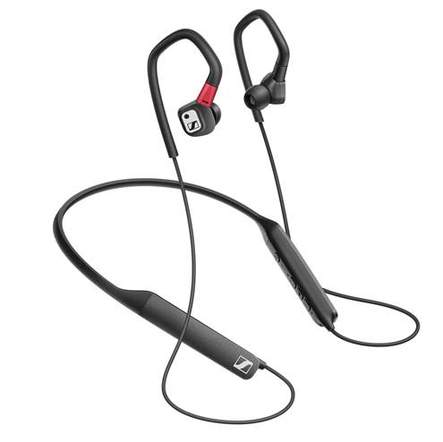
## 包耳式耳机：提供全面的声音体验
### Sennheiser的包耳式耳机满足您对声音的全部想象：细腻，丰满，开阔。那是Sennheiser传奇般的声音品质，还有舒适的佩戴感受。您钟爱的乐曲应该得到这样的舞台。
### 耳式耳机在整个耳朵周围创建声场。耳机采用柔软的皮革、人造革或天鹅绒制成的耳垫，即使长时间聆听也能确保舒适的佩戴。包耳式耳机可以采用封闭或开放式声学设计。一些封闭式型号使用先进的Sennheiser NoiseGard®技术，能够消除环境噪声。这项功能非常有用，特别是当您想在嘈杂的地方享受音乐时。
### Sennheiser拥有广泛的包耳式耳机型号，涵盖各种情况或生活方式。开放或封闭、有线或无线、玩游戏或家庭影音、蓝牙……还包括参考级耳机HD 820。
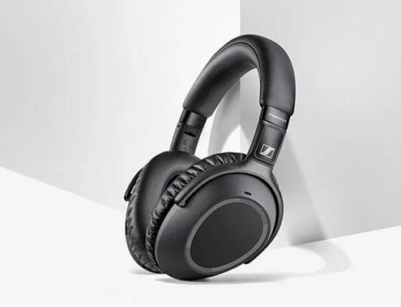
## 入耳式耳机：无线耳机
### 令您着迷的没有线缆束缚的耳机。
### 您和您喜爱的歌曲之间没有线缆的束缚，Sennheiser无线耳机一定可以满足每位用户的需求，即使是挑剔的音乐发烧友也不例外。而无损数字射频传输非常适合用于高端家庭音响，蓝牙耳机则适用于移动设备。Sennheiser无线耳机具有可靠和易于操作的特点，令您真正享受声音带来的喜悦。
### Sennheiser提供了广泛的无线耳机型号以迎合不同需求：从IR-立体电视系统、发烧级数字家庭系统到豪华的蓝牙旅行耳机。
### 没有线缆的牵绊是多么自由的感受。尽情欣赏您喜爱的音乐或电视节目，享受Sennheiser的声音和品质。
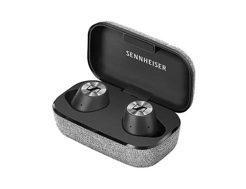
## 降噪耳机：纯净的音乐体验，不受背景噪声干扰。
### 世界充满了喧嚣，但您不用远行躲避。快使用Sennheiser降噪耳机，为自己创造一片宁静天地。NoiseGard®，Sennheiser的主动降噪技术，无论您身在何处，都能安静地享受音乐的乐趣。
### 耳机一般或多或少都能抑制环境噪声。但有时单纯的被动阻隔噪声是不够的：尤其是在嘈杂的地方或在飞机和公共汽车上。这就是Sennheiser所特有的NoiseGard®技术的魅力所在。简单地说：它识别噪声，并发出相反的信号——从负到正——从而中和噪声，所以它不会影响您聆听您喜爱的音乐。
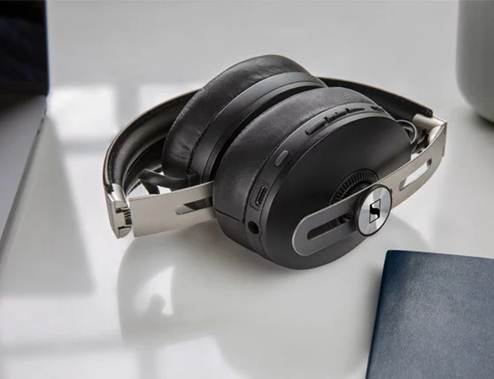

## Part four 产品分析
## 真无线耳机
## MOMENTUM True Wireless
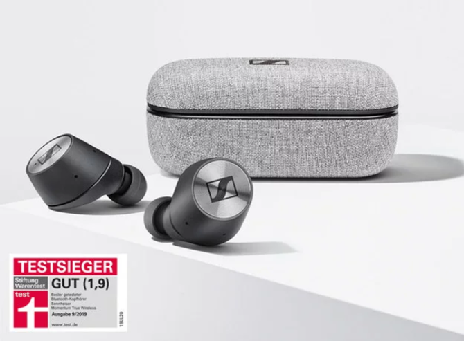
## 体验超长舒适佩戴
### 佩戴舒适，陪伴你一整天的音乐享受。轻巧又防水防汗的耳机，4种尺寸的耳垫可选，均符合人体工程学设计，能够满足每位用户舒适佩戴的需求。使用直观的触控板实现设备的无线连接，只须轻轻点击或滑动，即可播放音乐、接听电话、激活语音助手。一切控制尽在指尖。
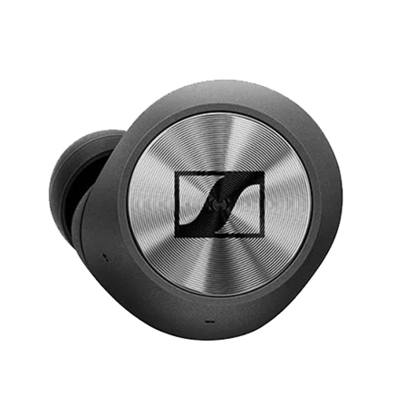
## 精雕细琢 经典优雅
### 注重细节，富于美感，这款小巧、靓丽而轻盈的耳机是技术与艺术的结合。它既是声音重放技术的成就，更是你耳畔精美的配饰。高级黑色外壳，闪烁的金属镭射表面，镀金的充电接触点——时尚与功能融合于标志性的设计之中。便携小巧的充电盒，能够将耳机的使用时长从4小时延长至12小时。因此你可尽享全天使用的乐趣，并满足未来所需。

## 在声音中感受它的魅力所在。
### 以专业录音级的声音质量来感受每一次的呼吸、音符和节奏。
### MOMENTUM真无线耳机专为聆听每一个声音的细节精心打造。
### 通过现代的外观造型和舒适的耳塞设计，让你尽情聆听喜爱的音频节目。而通过简单快捷的语音助理和触控操作更赋予上佳的用户体验。
### 当然我们更为在意的还是能让你听到什么。整合森海塞尔备受赞誉的专业音频技术力量创造出具有高声音品质的无线耳机产品，欢迎您来亲身体验。
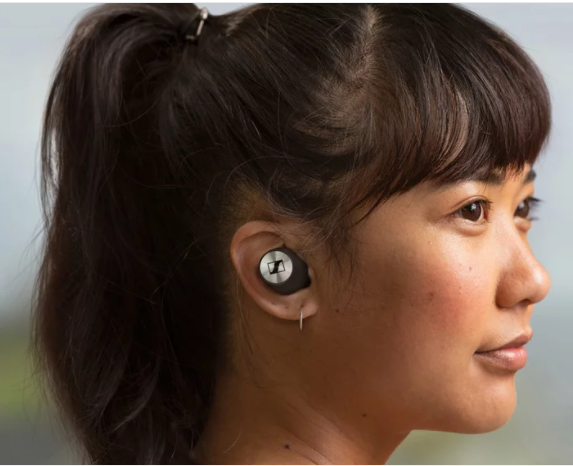
## 细节尽在掌握。
## 智能语音控制和智能助理。
### 当你将耳塞拿开时，音乐播放会自动暂停，而当你将它们重新配戴上之后，音乐播放会再度开始。另一个智能的功能就是自动充电：当你将耳机放回充电盒里，它们将会开始自动补充电能。
### 透明聆听功能让你能够留意到到周围的环境声音，即使没有摘掉你的耳塞也能够没有障碍的听到外界的声音以及与人交谈。而得益于双话筒声波聚束技术，在吵杂的环境中，耳机依然能够清晰拾取你的声音。
### 通过内置的高质量均衡器可以对声音进行精确的调整，满足你个性化的听音需求。
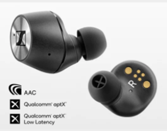
## 无线蓝牙降噪耳机
## PXC 550 Wireless
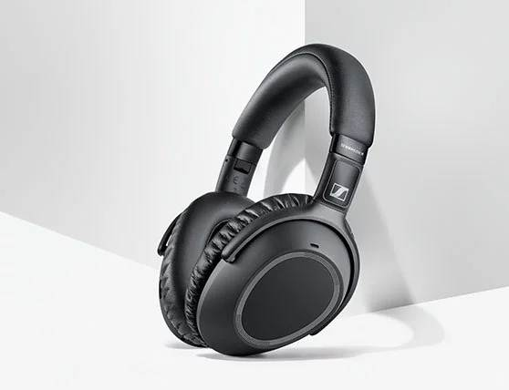
## 出行从此不同 升级到头等舱的体验
### 旅程中的音乐变得更加丰富多彩，带来更加身临其境般的感受。PXC 550无线耳机来自领先的音频厂商Sennherser，在过去 70 多年一直引领行业发展趋势。声音没有任何妥协：在任何音量下都保持深邃、清脆、强有力。品质非凡的PXC 550无线耳机让您在欣赏最喜欢的音乐或电影时，获得真正身临其境般的体验。
### 这款高性能旅行耳机呈现Sennheiser传奇性的声音特质。
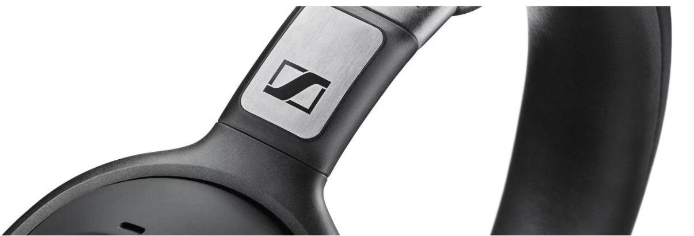
## 智慧出行：选择自由地移动
### 只有能够自由移动才意味着卓越的出行和音乐感受。PXC 550无线耳机让您梦想成真。没有耳机线的束缚，这款耳机采用了高科技传输领域杰出的解决方案来连接耳机，而近场通讯（NFC）让PXC 550无线耳机轻松地与移动设备进行连接。当然，PXC 550无线耳机也可以使用附送的耳机线进行连接。
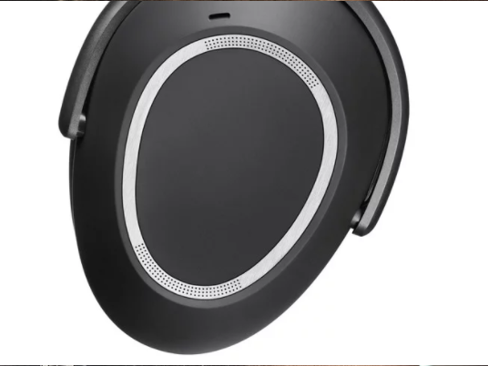
## 非常舒适
### PXC 550 无线耳机非常轻巧，便于携带，而且长时间佩戴也依然很舒适。为了确保用户舒适的佩戴，我们测量了数百人的耳朵形状，并据此设计了整体尺寸、特殊的耳垫形状以及头带结构。可折叠设计使其可以放入时尚而小巧的出行包中。非凡的舒适度和先进的设计：两全其美。
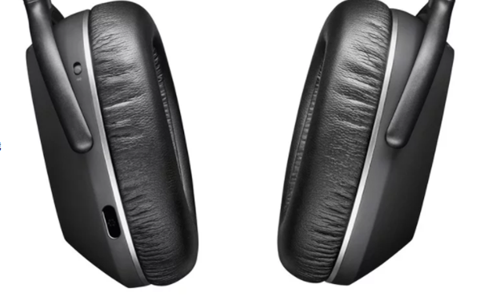
# THANK YOU
# For Watching!