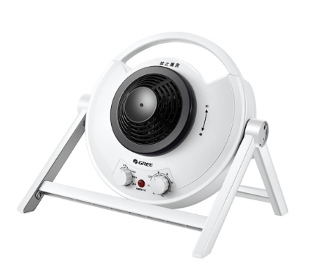
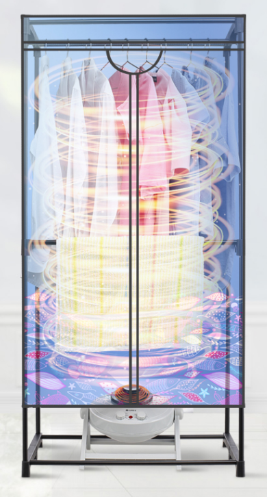
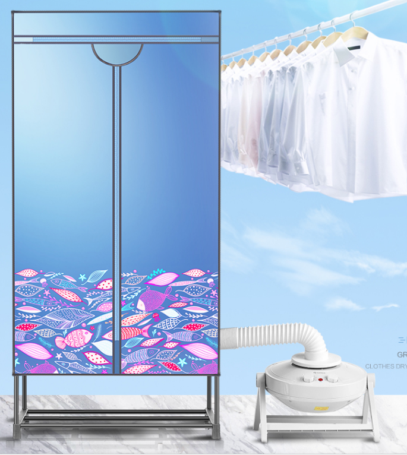
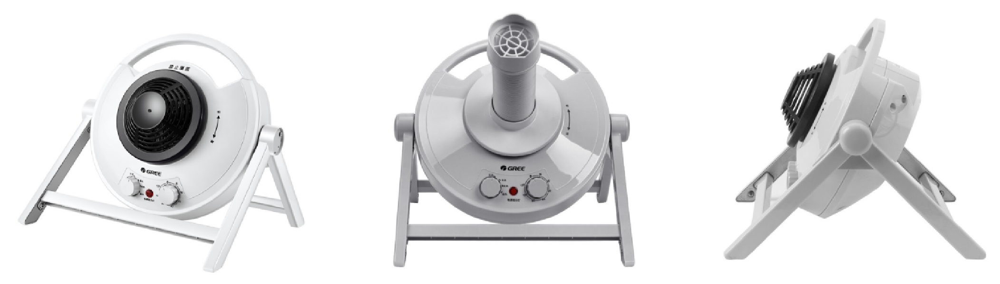
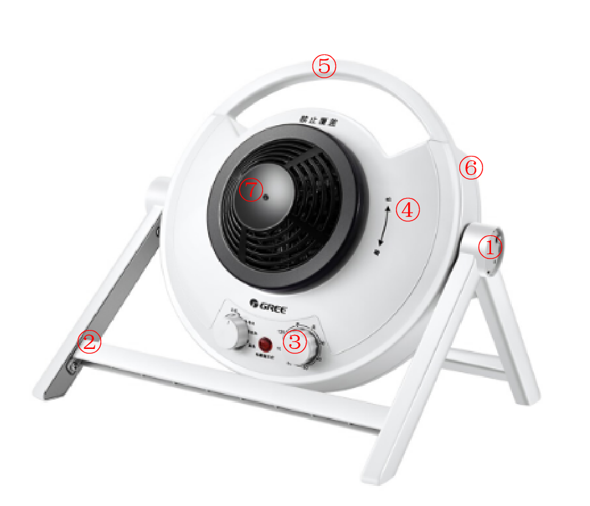
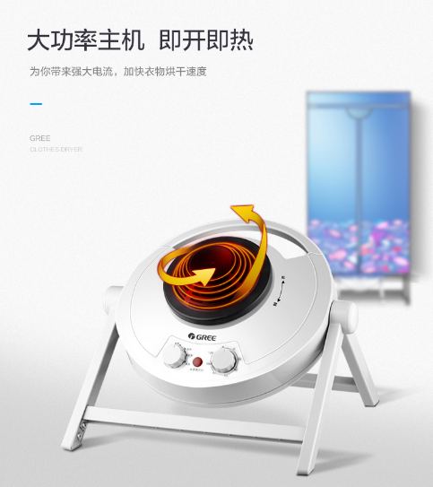
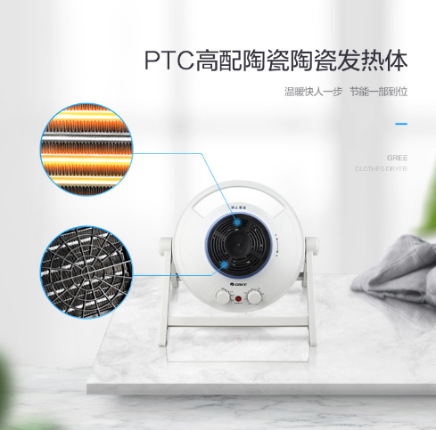
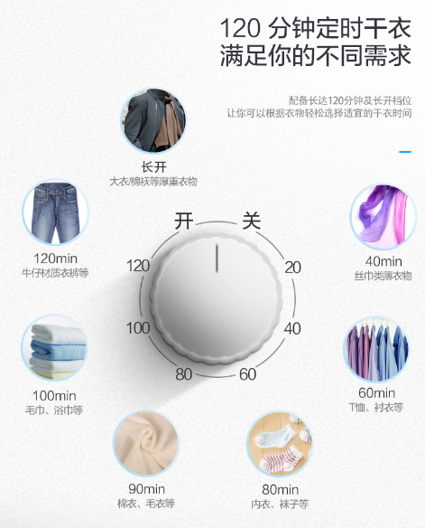
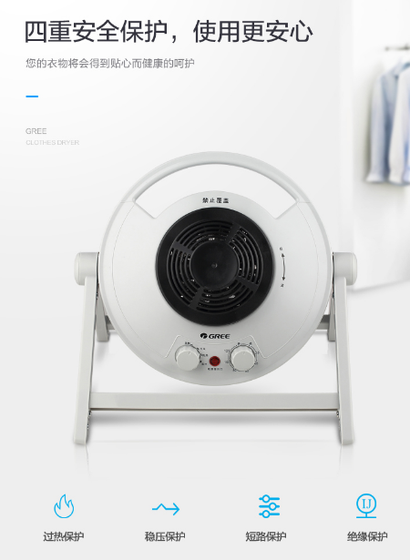

# 格力多用干衣机

## 一、产品简介
本机器的目的是让我们的衣服能够迅速烘干，特别在我国南方地区的阴雨天气，衣服很难才能吹干。它主要由干衣主机、支架、布罩、导风管组成。使用时，先将支架装好，然后套入布罩，将主机放置于支架下方或者使用导风管外部连接，连接电源，最后把准备要烘干的衣服放置于布罩内。

****
### 产品定位

产品名称：格力多用干衣机 

价       格：300~400元

尺       寸：330×250×180mm 

操作方式：手动 

使用场景：家用

主要功能：烘干衣服

重      量：4.68kg

功      率：500~1200W
****
### 产品使用场景

主机置于底部

主机通过导风管置于外部
****

## 二、产品设计分析

### 外观设计

随着社会的进步，人们生活水平的不断提高，追求完善已成为时尚。人们对消费产品的要求已不仅仅满足于基本功能的完备，同时更注重外观的美感。家电产品在不断提高和完善其功能的同时，在外观造型上要求越来越高，多以复杂方式自由地变化的曲线曲面即所谓自由型曲线曲面组成。而这一类形状单纯用画法几何与机械制图是不能表达的。

本干衣机的形态主要是正圆形，主机由三角支架撑起，正面有出风口、两个旋钮和一个指示灯。主机上方还有一个提手，便于人们的拿放。出风口里可以连接导风管。它的色彩和很多的普通家电差不多主要采用了亮白色与黑色。
****

### 结构设计

①活动关节（可调节主机出风口的角度）

②三角支架

③旋钮

④前盖

⑤提手

⑥后盖

⑦出风口

****

## 三、产品功能分析

****

## 四、产品不足的方面

本干衣机解决了回南天衣服不干的问题。由于本产品的体积、重量较大，人们只能局限于家里使用。

在旅行中，我们通常会住宾馆，大部分的宾馆都是没有设置阳台的。我们要晾衣服很困难，所以我们需要用到干衣机。本干衣机由于体积、重量较大，人们携带不方便，不适合旅行使用。

未来如果有一款能为旅行而设计的干衣机，那可以解决了人们旅行干衣不便的问题了！
