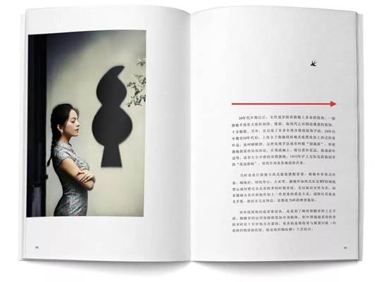

# 平面设计中的马斯洛层级需求
### -   以下主要理论来自《研习社》公众号
## 什么是马斯洛层级需求
马斯洛需求层级理论就是把需求呈阶梯式分成生理需求、安全需求、爱与归属感、尊重需求和自我实现需求这五类，他认为人类是按照低层级向高层级发展的，满足低层级的需求后会激发向高层级满足的欲望。人的发展几乎符合这个需求层级的顺序。

但我们需要注意的是马斯洛层级需求并不是绝对的。当我们满足了30%的生理需求后，对安全需求可能已经开始显现了，它可能是10%，对于其他的层级也是以此类推。

## 用马斯洛层级需求理论去思考平面设计的需求层次理论
### 平面设计中最低设计成本的产物是什么？

如果要说最底层的需求的设计，就像最低成本的这些牛皮藓，是最基本的信息传达，只有各种各样的信息填充在版面，直白而粗暴

汉字的阅读方向总是从左往右，因为大陆人不太习惯大量竖排的阅读顺序，所以在大陆，全部文字竖排的书籍会相对比较少。

比如，大家经常将页码安排在版面的下方，人们习惯之后，想要知道是第几页，就会很自然看向页面的下方

完成信息传达的基本要求后我们应该遵循的是设计的基本法则。

设计理论与设计的基本法则，也就是共通性，这种共通性能让我们更快地捕捉信息的传递。所以我们经常利用共有的一些设计规则，去准确地传达信息。

## 在通过信息表达和设计基本法则后可以满足我们的阅读需求后接下来的是什么??
心理学上存在一个这样的效应，叫“美即好效应”，说得这么高大上，其实就是我们常说的以貌取人，常常我们会觉得一个外表英俊漂亮的人，认为他在其他方面也很好。
这个理论也被用在了设计中，在《设计的125条通用法则》这本书里就有提到，叫“美即好用效应”，它提出要永远追求能创造美的设计，因为美的设计会被视为比较好用，并且容易马上被接受，并长期使用。

很多时候审美往往会趋向于同化，在这个浮躁、快节奏的社会，我们很多时候需要做出一些不一样的设计，来吸引别人的眼球。这个就是第四层级的需求。但要注意的是，做出特异性往往带有风险。

在矿泉水包装市场里，包装的风格与样式似乎都已经形成定性了，都是用山脉的图案，用渐变色、以及比较高饱和度的色调

直到农夫山泉的这款插画包装的出现，它的包装突破了原有矿泉水的风格，获得了很大的关注

当然了，也有很多独立和与众不同的风险性依然做得很好的例子。就比如日本高田唯的作品，高田唯的作品被称为“新丑风”，这种独特的设计风格让他成为一个焦点。

他这样描述过这个包装，椰树的包装没有这个商品“应该有的样子“。这样的设计能够存在于市场，让他觉得很有意思。

的确，在今天这么多同类产品中，它依然能被消费者识别，不仅与它30年老品牌的魅力有关，更重要的是它的包装的特别性。

与众不同的设计或许能够一时捕捉人的眼球，但是真正能存活在人们内心深处的设计，才是最长久的。就像人的一生中比较特别的事情或许能够记得住，但是真正影响他以及深深地刻在脑海中的，却是最痛苦或者最有强烈情感的事情。所以最后一层是情感与共鸣。

江小白，大家应该也不陌生，它的广告营销做得非常成功，那些话说出了很多人的心声，让产品与受众群体产生了一种“你的苦我知道”的感觉。这就是共鸣。

### 没有最好的设计，只有最合适的设计，就像大街上牛皮藓的设计，你如果把它设计得很漂亮或者很精致，反而效果会不好，观看者会认为它是很昂贵的广告，潜意识时不会去观看，因为往往看这类广告的人群就是更愿意接受低价快消的。理解这个理论，可以让我们通过权衡利弊去考虑设计的需求，也可以让我们理解，具备什么样条件的设计才是好的设计。
