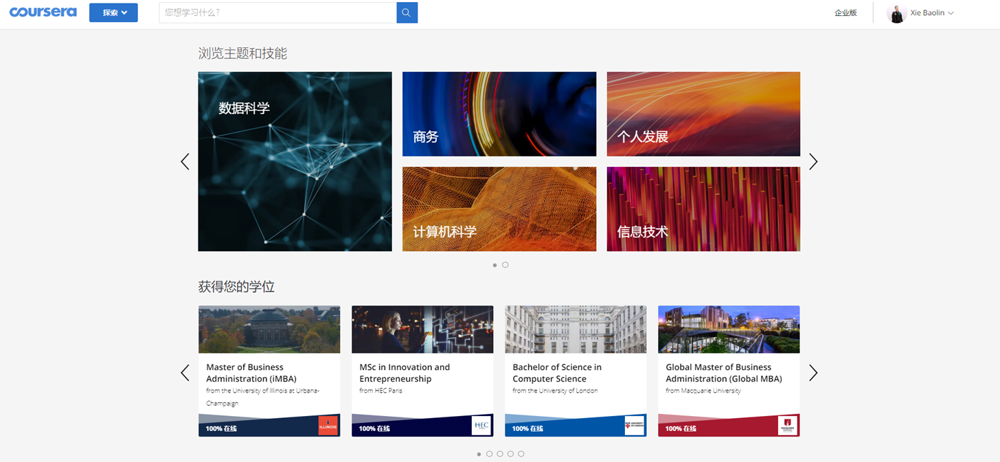
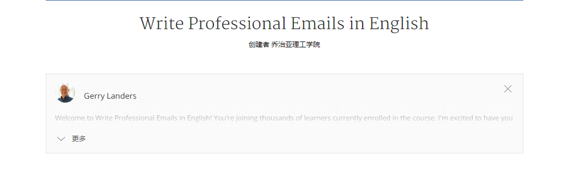
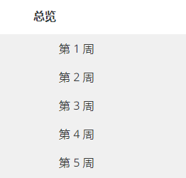
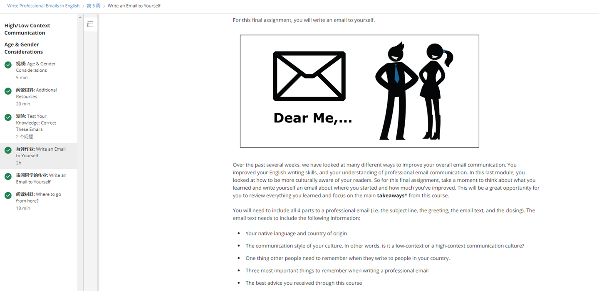
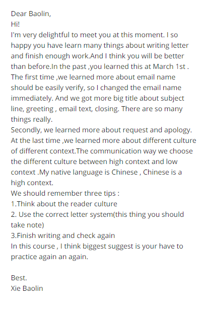
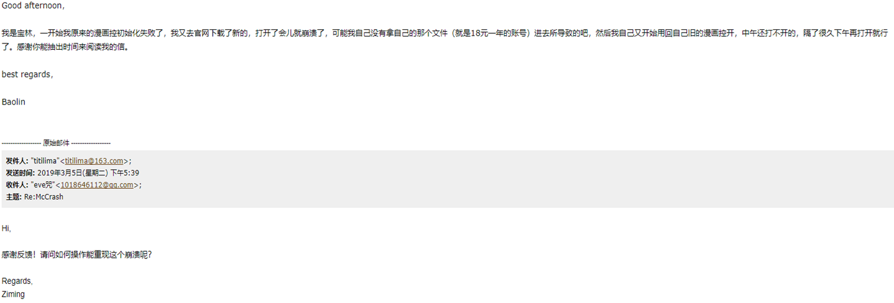
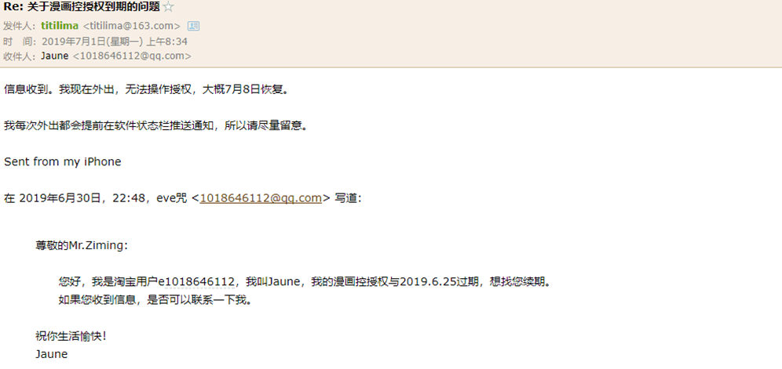

# Coursera

## 目录
1.Coursera的简介
2.我在coursera的一些经历

### 一、简介

Coursera是大型公开在线课程项目，由美国斯坦福大学两名计算机科学教授创办。旨在同世界顶尖大学合作，在线提供网络公开课程。

Coursera的首批合作院校包括斯坦福大学、密歇根大学、普林斯顿大学、宾夕法尼亚大学等美国名校   。

<h2>coursera主页</h2> 

Coursera与另外1达成合作协议。其课程报名学生突破了150万，来自全球190多个国家和地区，而网站注册学生为68万。注册124门课程。目前新增的大学包括了佐治亚理工学院、杜克大学、华盛顿大学、加州理工学院、莱斯大学、爱丁堡大学、多伦多大学、洛桑联邦理工学院 - 洛桑（瑞士）、约翰·霍普金斯大学公共卫生学院、加州大学旧金山分校、伊利诺伊大学厄巴纳 - 香槟分校以及弗吉尼亚大学。

#### 使命与传达理念

Coursera 是一个教育平台  ，它与全世界最顶尖的大学和机构合作，提供任何人可学习的在线课程。

Coursera期待在未来所有人都可以获得世界最高水平教育。 希望教育能够改善人们及其家人的生活，以及他们所在社区。

### 二、我的一些经历

在coursra上课
Write Professional Emails in English

#### 一、上课原则

1.有时间限制，大概是一周

2.有同学互评作业

3.可以参考和批同学的作业

4.可以看到不同国家的人他们的信息

5.每周有一项任务要完成

6.太迟交会没有同学给你评分，这科就挂了

个人感觉会比较拘束

##### 课堂作业

<h2>写给未来自己在信</h2> 

#### 二、经历
和一些淘宝卖家联系后

发现他们的写信规格很规范

然后自己再回去学
模仿对方再回复过去，发现生活中就是在学习

虽然有证书拿，但并不是每个大学都承认
过去我们很难去读书，现在我们读书很易，因为太多的培训机构了，外在条件有了，关键还是我们内在要去学。

#### 到最后的最后说一下个人感受
个人感受：关键还是要靠自己去学习
靠山山会倒，靠人人会跑
现在书本内容和网络比较，网络上的学习内容会更加快速的展示。
与其印刷书本，不如网络运营成本比较低。
1.利用资源（师兄师姐，学校资源，网络资源）；
2.小组学习；（反馈，分享思考）

# 感谢观看
