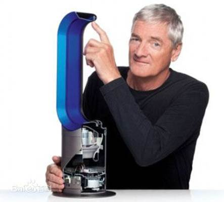
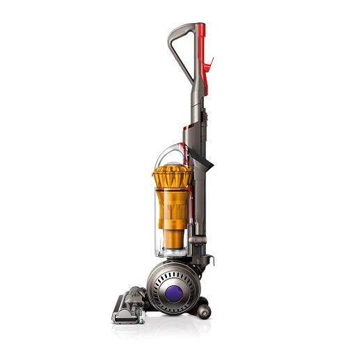
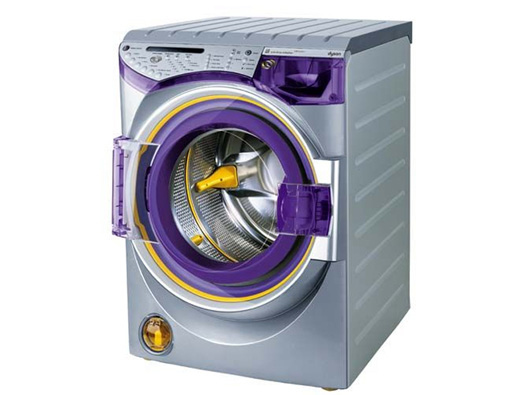

# 戴森的研发之路
### -   以下主要理论来自《企业管理杂志》公众号
## 戴森公司
戴森（Dyson）公司是一家总部设在英国的工程技术创新公司，于1993年开始从事真空吸尘器的生产和销售业务。公司创始人——素有“英国设计之王”之称的詹姆斯·戴森，被英国媒体誉为除维珍集团的理查德·布兰森外，最受英国人敬重的、富有创新精神的企业家。他所发明的双气旋系统，被看作是自1908年第一台真空吸尘器发明以来的首次重大科技突破，彻底解决了旧式真空吸尘器气孔容易堵塞的问题。

综观吸尘器的百年发展史，戴森公司的创新精神是独一无二的。在创始人詹姆斯·戴森的领导下，公司已经发展为英国最具创新力的家电企业之一。

## 从技术革新起家

詹姆斯·戴森曾经发明了很多有用的东西，也获得过许多项设计大奖。其中一个发明成果叫做“ballbarrow”（球轮手推车），它是一个用球代替轮子的手推车，有着很好的稳定性和灵活性。
1978年，詹姆斯·戴森发现在“ballbarrow”的喷射处经常被粉末颗粒所堵塞。在亲自观察到传统吸尘器的缺点后，詹姆斯·戴森开始着手研制气旋式无袋家用吸尘器。为此詹姆斯·戴森花了五年时间，世界上第一个无袋真空吸尘器终于诞生了。
 
 随后，詹姆斯·戴森用了两年的时间在英国和欧洲各国到处撒网，为新产品的上市寻找合作伙伴。但遗憾的是没有人对他的新技术感兴趣，也没有人愿意接受抛弃使用袋子而尝试无袋式真空吸尘器的观念。最终，詹姆斯·戴森找到了一家日本公司来制造，并于1986年在日本推广，上市后获得极大成功。 

于是，詹姆斯·戴森决定用合约制造方式将产品投放英国市场。但是他发现那些潜在的契约方并不能提供令其满意的质量和服务。1993年6月，詹姆斯·戴森向朋友借了60万英镑设立了自己的研究中心和工厂，开始制造吸尘器产品。公司生产的第一代吸尘器产品就是DC01，成为英国最畅销的真空吸尘器产品。戴森公司的双重气旋式系统在市场上的表现证明，假如企业所提供的产品比市场上其他任何一个产品都要高效，那么消费者不仅会购买它，而且还会愿意多支付一点费用。在戴森真空吸尘器投放市场的四年后，公司获得了英国家用真空吸尘器33%的市场份额。

## 戴森的研发路径
### 独特的产品研发过程

 戴森公司对待产品研发有着一套自己的模式。我们以Contrarotator洗衣机为例来说明公司研发产品的大致过程。詹姆斯·戴森因为经常碰到传统洗衣机所带来的一些问题，如洗不干净等，动员他的设计工程师小组着手研制这种新型高效的洗衣机。
       

工程师们首先展开市场研究。与其他公司不同的是，戴森公司的工程师将研究范围尽可能局限在最小范围内，他们进行市场研究的目的只是为了支持他们自己的想法，而不是为了改变或影响其研发工作。在很长一段时间里，工程师们观察人们平均多少天洗一次衣服，每次洗衣服的量，以及洗涤物的类型。为了方便观察和事后统计分析，工程师们通常将观察目标依据其生活背景、年龄、性别和生活习惯等划分成不同组群，然后逐一询问他们各种问题，如你觉得现在使用的洗衣机有哪些令人不满的地方，你希望通过使用洗衣机得到什么样的预期效果等。一般情况下，这些工程师的调查往往开始于同一个问题：“请问你是如何将衣服洗干净的？”在得到调查对象的回答后，工程师们就着手将答案进行归类，找出许多种可能性进行分析推敲，最后确定要重点突破的若干个方案。
      

 接着，便是工程师们研究新技术解决问题的阶段。他们反复地设计一些装置来测试所能想到的每个方面。四个月后，他们有了一个惊人的发现，15分钟的手洗居然比67分钟运作良好的机洗要洗得更加干净！经过他们的仔细研究发现，原来除去污垢最有效的方法将织物纤维弯曲，平时用手搓洗衣物就是将织物纤维弯曲后进行摩擦。于是工程师们就着手寻找一种模仿手洗的方法，并且在手洗动作上作进一步改进。三个月后，他们发现在洗衣机里放两个内室，并朝相反方向旋转，能够很好地完成他们苦苦寻求的洗衣效果。
       

有了新技术，接下来的任务就是机器的设计与制造。工程师们测试了各种各样的物质应用于洗衣机的不同部件，过程中包括复杂的设计和产品工程，设计工程师不仅要设计洗衣机的部件，而且还要设计生产洗衣机的制造工具。
   

 Contrarotator洗衣机在英国市场上一经推出就受到消费者的极大青睐。这与公司先前对整个研发过程的重视是分不开的。

## 攻城略地的戴森营销
### 从高端市场掘金
许多使用戴森公司产品的客户都知道，戴森产品的价格与市场上的同类产品相比高出一大截。一般情况下，一台戴森真空吸尘器售价约200－300英镑，而其他品牌同类产品售价低于200英镑。销售高质量的产品是戴森一贯的宗旨。外界评论认为，戴森的产品价格远远高于竞争对手，原因是“为了反应产品的真正价值，产生足够的利润，它不得不采取高价策略”。
       
 直到后来进军美国市场，他仍然坚持以高端市场为攻克目标。美国是一个实用主义国家，价格对于他们来讲是非常注重的。无袋吸尘器的价格被降到100美元以下，而直立式吸尘器的价格甚至曾跌破50美元。所以，当时以胡佛和伊莱克斯为首的市场领导者，大多采取中低价销售策略。而戴森采取高价策略进军美国，其所面临的风险可想而知。但是进军美国市场不到两年，尽管它的价格高达450美元，他的革命性发明还是帮助他打败了盘踞市场近100年的胡佛牌吸尘器，成为美国家用清洁品市场的老大。
       
 曾有人提出，戴森公司的这种市场定位战略有些违反常规，对于一个当时刚起步的小公司而言尤其如此。当戴森首次推出DC01时，它的产品无人知晓，当时的市场已经被胡佛和伊莱克斯这样的全球巨头所占领，要想争得一席之地，并非易事。而戴森又偏偏采用高价策略，可以想见当时一些市场分析人士对于戴森抱的是何种态度。尽管如此，戴森还是坚持以高价为市场定位策略，并一路走到现在。
### 专业化细分市场
 一般情况下，企业对于产品的使用者要进行细分，根据某一部分消费者的特点和需求来设计和制造产品。比如戴森的DC04银/石灰系列就是专门为满足家庭清洁地毯的需要而设计。又如进入美国市场时，考虑到美国人喜欢养宠物，一定会有人为出现过敏症状或为地毯上宠物的毛发而发愁，戴森的广告针对的目标就是30－40岁之间特别容易过敏的人群和宠物所有者。这些人有一定的经济实力，相比20－30岁的人价格接受力要强。
        
 要获得一个理想的细分市场应具有以下几个特征：要有足够的市场潜量和购买力；市场有发展潜力；对主要竞争者不具有吸引力；企业具备有效地为这一市场服务所必需的资源和能力；企业已在顾客中建立起良好的信誉，足以对抗竞争者，等等。而成功细分市场的主要策略就是实行专业化。公司必须在市场、顾客、产品或渠道等方面实行专业化。随着戴森公司的规模不断壮大，产品种类越来越丰富，在产品专业化的同时，其他配套环节也逐步走向专业化
### 从拒绝到广告大户
也许很多人都不会相信，詹姆斯·戴森先前对广告是极其排斥的。1993年，当第一代真空吸尘器DC01投放英国市场时，詹姆斯·戴森就拒绝做任何广告，只是依靠亲自说服和在报纸上发表文章来宣传自己的产品。几年以后，情况发生了变化。戴森公司开始在一些媒体上做广告，以提高产品的知名度和销售量。2001年，戴森公司首次与直销代理机构商谈有关发展其品牌的首个关系营销战略事项。同年，为配合Contrarotator洗衣机投放市场，戴森砸下350万英镑，紧锣密鼓地展开了一系列电视广告运动。为此Contrarotator赢得了营销协会营销效果奖中耐用品和汽车类别的最高奖项。该协会国际主席迈克·约翰斯顿说：“戴森公司的营销途径为我们作出了很好的示范，那就是——创新的思考，缜密的战略计划和成功的执行。”
      
 2001年对于戴森公司来说是轰轰烈烈的 一年。在同类企业中，这一年戴森一直保持着广告费支出的第一位，它的广告预算达到210万英镑，占所有广告支出费用的25%，相比较而言，戴森比排名第二的市场新进入者LG公司的广告费支出高两倍多
 ## 戴森公司的成功之道
分析戴森公司的成功因素，其实有很多，就早期而言它的成功主要来自于口头传播和在报纸上发表文章。
    
 当年詹姆斯·戴森决定在英国推广DC01时，许多零售商纷纷拒绝采购，原因是DC01的价格远远高出当时的领导品牌。但是詹姆斯·戴森并没有气馁，也没有因此放弃自己的梦想。依据传统观念，詹姆斯·戴森此时应投入大量金钱去给自己的产品做广告，展开大规模的营销运动，而詹姆斯·戴森却没有这样做，他选择了完全不同的途径。他不断用吸尘器的质量去说服那些零售商，依靠人与人之间的口头传播去产生购买行为，并且时不时地在报纸上发表几篇关于DC01的文章。最终DC01打入了国有百货公司John Lewis，销售量开始逐步增加。
    
因此，口头传播与发表文章对于当时的戴森公司而言，发挥了决定性的作用。尽管现在的消费者能够得到大量、各式各样的信息源，然而有关如何有效控制消费者购买决策的最重要的事情之一是“个人的接触”，它包括消费者以前的经验，其他个人的推荐，以及来自朋友和家庭的建议。

尽管戴森公司之后还有其他的产品促销的举动，但口头传播一直是它最重要的宣传手段，2008年公司进入中国市场后采用的促销手段与其全球的营销战略一致，主要是通过人与人的口头传播来进行推广。
### 戴森公司成功的原因还包括产品推出的适时性，重视研发，以及为消费者的需要而设计等等
