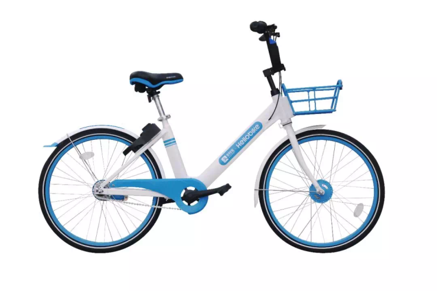
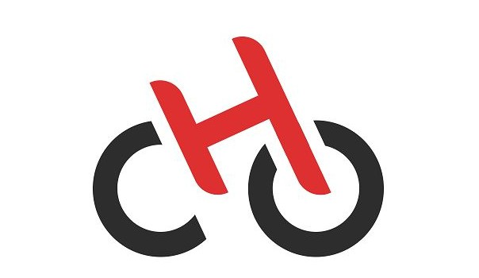
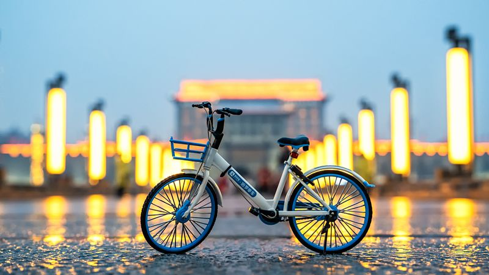

# 哈喽出行
哈喽单车的成型之路
>## 基本信息

哈啰出行是致力于为用户提供便捷、高效、舒适出行工具和服务的专业移动出行平台。自2016年9月成立以来，哈啰出行凭借差异化策略、智能化技术驱动的精细化运营、成本控制能力和用户体验，从共享单车市场竞争中成为共享单车行业市场和用户口碑的领导者，并进化为囊括哈啰单车、哈啰助力车、哈啰电动车服务、哈啰换电和哈啰顺风车等综合业务的专业移动出行平台。

### **哈喽单车**
>## 历程
2016年11月，哈啰单车1.0正式投放市场，车辆已迭代至4.0。哈啰单车的精细化运营已经进入2.0阶段——即智慧运营，基于哈啰大脑这一智能决策与指挥中心，驱动智能供需预测、智能规划、智能调度、智能派单等单车全链路运营智能化  。

2018年3月13日起，哈啰单车启动全国范围信用免押骑行，芝麻分650以上的用户，即可在全国免押金骑行哈啰单车。同时，为了方便用户在出行过程中临时停车，每日首次换骑15分钟内免费。Hellobike的工作人员通过夜间巡检和数据分析发现，市民对于这种新型的出行方式接受度高，在地铁、公交停运后，有大量用户有出行需求。Hellobike宣布夜间骑行免费，做城市出行系统的补充。 
哈啰单车作为基石业务，基于单车广泛而高频的流量入口，哈啰正拓展更多高成长性的多元业务。已在全国300余所高校落地哈啰校园业务，惠及近百万大学生用户群体。未来哈啰将致力于满足用户多场景、多距离的一体化智慧出行生态服务。
***
### **1.0时代**

***
### **2.0时代**

>## 为何成功？

### **起步较晚，吸取ofo和摩拜的经验教训**

### **阿里投资和政府扶持**
