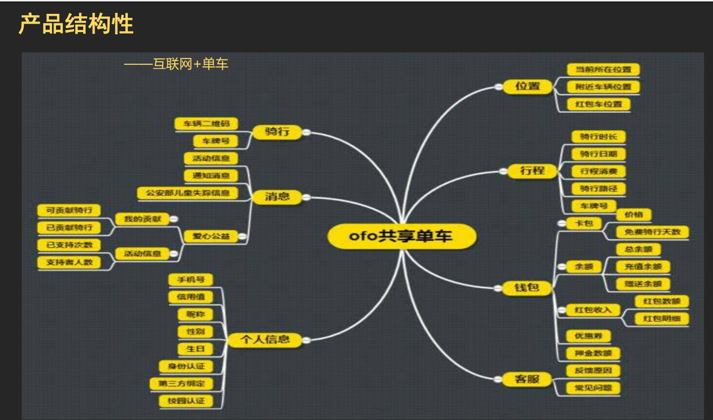

## 
共享单车ofo

陈欢 编

## 01. 产品设计思路
用户需求
北京大学校园内景点多，
面积大，步行游览时费力，
因此成为共享单车优质市
场，人们需求大。

## 02. 产品设计
ofo对车身进行了硬件升级，比如采用了转动车铃、
车把采用了三角形把立、22寸车轮、实心胎、密封中
轴、鼓刹，此外，小黄车还采用了可调节车座、以及
加固的车圈。
新版本小黄车升级了密码锁，从原来的方盘式按键密
码锁升级为圆柱式转盘密码锁。开锁密码多了，小黄
车被猜出密码的可能性就会变小。

